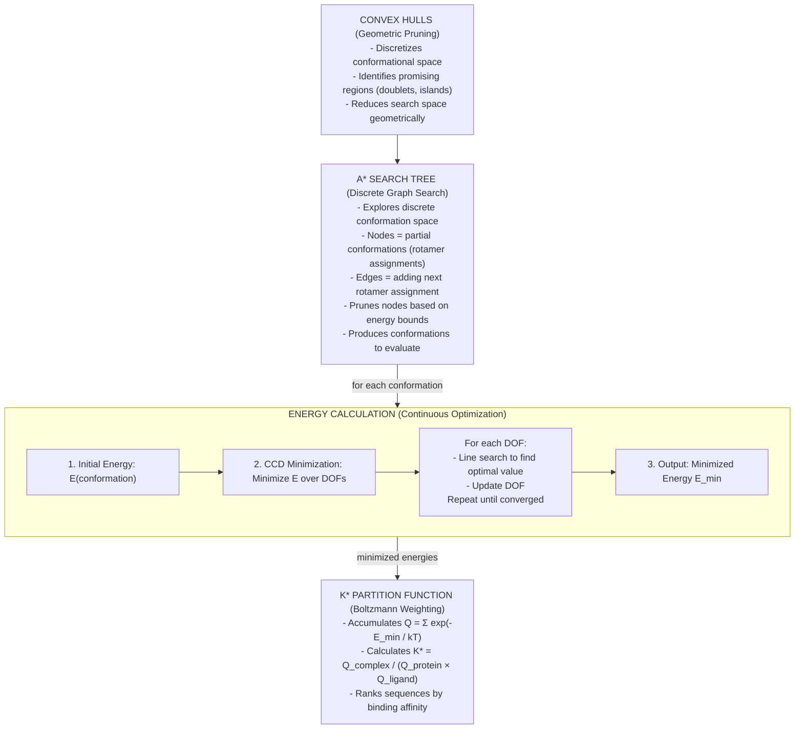

# CCD Minimization Review

## What is CCD Minimization?

**CCD (Cyclic Coordinate Descent)** is a local optimization algorithm that minimizes energy by optimizing degrees of freedom (DOFs) one at a time in a cyclic manner.

### Algorithm Overview

1. **Input**: Initial conformation with DOF values (dihedral angles, translations, rotations)
2. **Objective**: Minimize energy function E(DOF₁, DOF₂, ..., DOFₙ)
3. **Method**: 
   - Iterate up to 30 times (max_iterations)
   - For each DOF in sequence:
     - Perform line search along that DOF's dimension
     - Find value that minimizes energy (keeping other DOFs fixed)
     - Update that DOF's value
   - Evaluate total energy after updating all DOFs
   - If improvement < threshold (0.001), stop (converged)
   - If no improvement, revert and stop

### Key Characteristics

- **Local optimization**: Finds nearby energy minimum, not global optimum
- **Coordinate-wise**: Optimizes one dimension at a time (separable optimization)
- **Iterative refinement**: Multiple passes through all DOFs until convergence
- **Adaptive step size**: Step size decreases as iterations increase (step = initial / (iter+1)³)

## Relationship to Other Components

### 1. Energy Calculation (Not Graph Search)

**CCD is NOT part of graph search**. It's a **continuous optimization** step used within energy evaluation.

```
Conformation → Energy Function → CCD Minimization → Minimized Energy
```

### 2. Usage in OSPREY Workflow

**Within Energy Evaluation:**
- A* tree node needs energy score → Evaluate conformation → Minimize with CCD → Get minimized energy
- Partition function needs minimized energies → Minimize each conformation with CCD → Accumulate Boltzmann weights

**Not Used For:**
- Graph traversal (A* handles this)
- Sequence selection (K* handles this)
- Space discretization (convex hulls handle this)

### 3. Component Hierarchy



## Key Distinction

### Discrete vs Continuous

**Discrete (Graph Search):**
- A* explores **discrete space** of rotamer assignments
- Nodes are discrete choices (which rotamer at each position)
- Pruning eliminates entire branches

**Continuous (CCD Minimization):**
- CCD optimizes **continuous space** of DOF values
- Optimizes dihedral angles, translations, rotations (real numbers)
- Finds local energy minimum for a given discrete conformation

### Pruning vs Optimization

**Pruning (A*, Convex Hulls):**
- Eliminates entire regions of search space
- Based on bounds, heuristics, geometry
- Reduces what needs to be evaluated

**Optimization (CCD):**
- Refines a single point in space
- Based on gradient-like search (line search per dimension)
- Improves quality of evaluation

## Example Flow

1. **Convex Hulls** identify: "Residues 5 and 7 should be mutated together"
2. **A* Search** generates: Conformation with rotamer assignments [R1=Ala, R2=Val, R5=Leu, R7=Ile, ...]
3. **Energy Calculation** for that conformation:
   - Initial energy: E = 100 kcal/mol
   - **CCD Minimization**: Optimize dihedral angles
     - Iteration 1: Optimize DOF₁ → E = 95 kcal/mol
     - Iteration 2: Optimize DOF₂ → E = 92 kcal/mol
     - Iteration 3: Optimize DOF₃ → E = 90 kcal/mol
     - Converged: E_min = 90 kcal/mol
4. **Partition Function**: Add exp(-90/kT) to Q
5. **K* Score**: Use Q values to calculate binding affinity

## BEYOND Voxel Connection

In BEYOND's voxel approach:
- **Voxels** discretize continuous conformational space (similar to convex hulls)
- **Search tree** explores voxels (similar to A*)
- **Quantum calculations** optimize within voxels (similar to CCD, but quantum-accurate)
- **Partition function** accumulates over voxels (similar to K*)

CCD is the **force-field equivalent** of BEYOND's quantum optimization within voxels.

## Summary

**CCD Minimization:**
- **Purpose**: Local energy optimization (continuous)
- **Role**: Refines conformations within energy evaluation
- **Not**: Graph search, pruning, or discrete optimization
- **Relationship**: Used by A* and K* to get accurate minimized energies

**Graph Search Pruning (A*, Convex Hulls):**
- **Purpose**: Explore and prune discrete conformational space
- **Role**: Reduces what needs to be evaluated
- **Uses**: CCD minimization for accurate energy evaluation

These are **complementary**: pruning reduces search space, CCD optimizes within that space.

