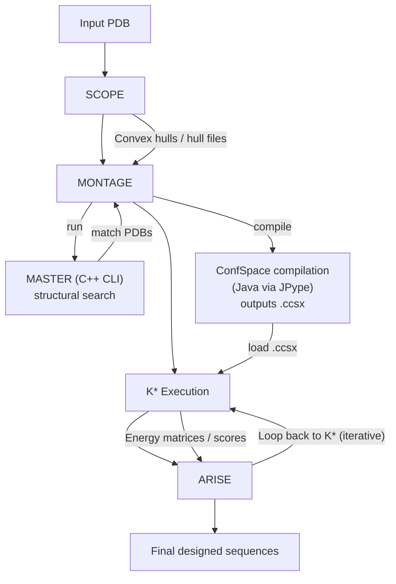

# Complete OSPREY Pipeline Overview

## Summary

**Profile Results Location:**
- `pipeline_analysis/arise/test_arise_10_matches/arise_profiling_summary.md`
- `pipeline_analysis/montage/test_montage_full/` - Full MONTAGE profiling (with MASTER)
- Individual files in same directories

**Workload Variation Analysis:**
- `docs/performance/WORKLOAD_VARIATION_ANALYSIS.md` - How system size propagates through stages

## Complete Pipeline Stages

### Stage 0: Input Preparation
**Purpose:** Prepare input structures and parameters
**Components:**
- PDB file loading
- Structure validation
- Parameter file parsing
- **Not profiled** - Typically fast

### Stage 1: SCOPE (Convex Hull Analysis)
**Purpose:** Identify potential contact points between design and target chains
**Components:**
- Rotamer library alignment
- Convex hull generation (VTK)
- Volume overlap calculations
- Intersection testing
**Profiling:** `pipeline_analysis/scope/`
**Bottlenecks:** VTK operations, file I/O
**Scaling:** O(n²) where n = residues

### Stage 2: MONTAGE (Scaffold Generation)
**Purpose:** Generate scaffold structures for design
**Components:**
- MASTER C++ subprocess (structural search)
- Scaffold PDB generation
- ConfSpace compilation (Java via JPype, requires LocalService)
- File organization
**Profiling:** `pipeline_analysis/montage/`, `pipeline_analysis/confspace_compilation/`
**Bottlenecks:** **ConfSpace compilation (80% of time)**, MASTER subprocess (~12s/match), SCOPE operations
**Scaling:** O(queries × pairs)
**Note:** Full profiling shows ConfSpace compilation dominates (1744s/2191s), MASTER is fast (63s for 5 matches)
**ConfSpace Details:**
- Target: 52.73s compile time
- Design: 381.49s compile time (7.2x longer)
- Complex: 398.87s compile time (7.6x longer)
- Sequential total: 858.68s (14.3 minutes) for all three
- Parallel blocked by LocalService singleton limitation

### Stage 3: K* Execution (Partition Function)
**Purpose:** Calculate binding affinity (K* scores) for sequences
**Components:**
- Energy matrix computation (C++ via JNA)
- A* search tree construction
- Partition function calculation
- Convergence checking
**Profiling:** `pipeline_analysis/full_kstar/`
**Bottlenecks:** Often **dominant** at end-to-end scale (full convergence can be hours to days depending on system size and convergence gap)
**Scaling:** O(sequences × pairs × iterations)

### Stage 4: ARISE (Iterative Design)
**Purpose:** Iteratively design full sequences
**Components:**
- K* result parsing
- Best doublet selection
- Graph updates (SCOPE re-runs)
- Sequence generation
**Profiling:** `pipeline_analysis/arise/`
**Bottlenecks:** Blocked by K* completion, SCOPE re-runs
**Scaling:** O(matches × iterations × K*_time)

## Additional Components (Not Main Pipeline Stages)

### Energy Calculation (C++ Native)
**Purpose:** Compute molecular energies
**Location:** `src/main/cc/ConfEcalc/`
**Components:**
- Amber forcefield calculations
- EEF1 implicit solvent
- CCD minimization (OpenMP)
**Profiling:** Limited - native code not visible to JVM profiler
**Bottlenecks:** Matrix operations, force field calculations

### ConfSpace Compilation (Java + LocalService)
**Purpose:** Compile conformation spaces from structures
**Location:** Java OSPREY core + Python LocalService
**Components:**
- LocalService HTTP server (port 44342) for AmberTools/LEaP access
- Rotamer assignment
- Pair enumeration
- Forcefield parameterization (via LEaP subprocess calls through LocalService)
- Energy matrix initialization
**Profiling:** `pipeline_analysis/confspace_compilation/` (detailed), part of MONTAGE profiling
**Bottlenecks:** **DOMINANT in MONTAGE** - 80% of total time (1744s/2191s observed)
- Compilation time: 52.73s (target) → 381.49s (design) → 398.87s (complex)
- LocalService singleton prevents thread-based parallelization
- LEaP subprocess calls (100-1000 per complex confspace)
**Scaling:** O(pairs) - compilation time scales with conformation space size

### File I/O Layer
**Purpose:** Data persistence between stages
**Components:**
- PDB file reading/writing
- ConfSpace file (.ccsx) serialization
- K* result files (TSV)
- Hull file storage
**Profiling:** Visible in I/O analysis
**Bottlenecks:** **MAJOR** - Multi-process architecture requires file I/O

### JVM/JPype Bridge
**Purpose:** Python → Java communication
**Components:**
- JVM startup/initialization
- JPype method calls
- JNA native method calls
**Profiling:** Visible in startup overhead
**Bottlenecks:** Startup time (~3s), marshalling overhead

## Pipeline Flow

## Profiling Coverage

| Stage | Profiled | Location | Status |
|-------|----------|----------|--------|
| SCOPE | Yes | `pipeline_analysis/scope/` | Complete |
| MONTAGE | Yes | `pipeline_analysis/montage/` | Complete |
| K* Execution | Yes | `pipeline_analysis/full_kstar/` | Complete |
| ARISE | Yes | `pipeline_analysis/arise/` | Complete |
| Energy Calc (C++) | Limited | Limited | Native code, needs `perf` |
| File I/O | Yes | Part of each stage | Visible |
| JVM/JPype | Yes | Startup overhead | Visible |

## Key Findings

### Bottlenecks (in order)
1. **K* Execution** - 1-2 days for medium systems (DOMINANT)
2. **ConfSpace compilation** - 80% of MONTAGE time (1744s/2191s observed)
3. **File I/O** - Multi-process communication overhead
4. **MASTER subprocess** - ~12 seconds per match (fast, not a bottleneck)
5. **JVM startup** - ~3s per process
6. **Module imports** - ~20s Python startup

### Workload Variation
- **Small systems** (1K pairs): Minutes to hours
- **Medium systems** (10K pairs): Hours to days
- **Large systems** (17K pairs): Days to weeks

### Parallelism Opportunities
1. **K* sequences** - Independent, can parallelize
2. **MONTAGE matches** - Independent, can parallelize
3. **Energy calculations** - Already parallelized (OpenMP)
4. **SCOPE pairs** - Independent, can parallelize

### Architecture Issues
1. **Multi-process** - File I/O bottlenecks
2. **Multi-language** - Marshalling overhead
3. **Memory fragmentation** - JVM + native memory
4. **Sequential stages** - No pipelining

## Next Steps

1. **Profile native C++ code** - Use `perf` for energy calculations
2. **Measure workload scaling** - System size → time relationships
3. **Characterize memory scaling** - Pairs → memory usage
4. **Design unified architecture** - Address identified bottlenecks
5. **Implement parallelization** - Focus on K* and MONTAGE

