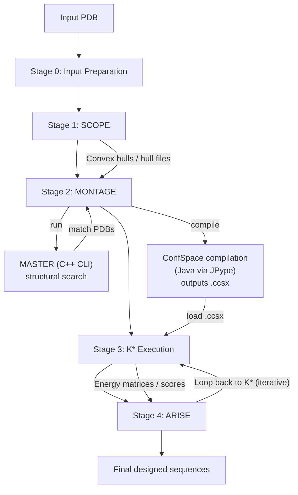

# OSPREY Pipeline Stages Summary

## Complete Pipeline Flow

## Stage 0: Input Preparation

**Purpose:** Prepare input structures and parameters

**Components:**
- PDB file loading
- Structure validation
- Parameter file parsing

**Status:** Not profiled (typically fast)

**Location:** Various Python/Java modules

## Stage 1: SCOPE (Convex Hull Analysis)

**Purpose:** Identify potential contact points between design and target chains

**Components:**
- Rotamer library alignment
- Convex hull generation (VTK)
- Volume overlap calculations
- Intersection testing

**Profiling:** Complete
- Location: `pipeline_analysis/scope/`
- Total time: 208.3s (3.5 min)
- Peak memory: 388 MB

**Bottlenecks:**
1. Volume overlap calculation (79.6%)
2. Module imports (15.3% - VTK/PyVista)
3. Hull generation (6.6%)

**Hot Functions:**
- `v_dot`: 114.6s (17.4%), 268M calls
- `calculate_volume_overlap`: 174.8s (26.5%)
- `inside_all`: 90.3s (13.7%), 40M calls

**Scaling:** O(n²) where n = residues

**Optimization Potential:** 20-400x (vectorization, spatial indexing, parallelization)

## Stage 2: MONTAGE (Scaffold Generation)

**Purpose:** Generate scaffold structures for design

**Components:**
- MASTER C++ subprocess (structural search)
- Scaffold PDB generation
- ConfSpace compilation (Java via JPype, requires LocalService)
- File organization

**Profiling:** Complete
- Location: `pipeline_analysis/montage/`, `pipeline_analysis/confspace_compilation/`
- Total time: 2191.3s (36.5 min)
- ConfSpace compilation: 1744s (79.6%)

**Bottlenecks:**
1. **ConfSpace compilation** - 79.6% (1744s)
   - Sequential compilation (target/design/complex)
   - LocalService singleton blocks parallelization
   - LEaP subprocess calls via HTTP API (100-1000 per complex)
2. SCOPE operations - 8.6% (188s)
3. MASTER subprocess - 2.9% (63s) - Fast, not a bottleneck

**ConfSpace Compilation Details:**
- Target: 52.73s compile (61.59s total)
- Design: 381.49s compile (388.44s total) - 7.2x longer
- Complex: 398.87s compile (408.65s total) - 7.6x longer
- Sequential total: 858.68s (14.3 minutes)

**LocalService:**
- Python context manager (`osprey.prep.LocalService`)
- Starts HTTP server (port 44342) for AmberTools/LEaP access
- Singleton pattern - only one instance allowed
- Blocks thread-based parallel compilation
- Required for ConfSpace compilation (forcefield parameterization)

**Scaling:** O(queries × pairs)

**Optimization Potential:** 10-50x (after LocalService fix, LEaP batching, fragment caching)

## Stage 3: K* Execution (Partition Function)

**Purpose:** Calculate binding affinity (K* scores) for sequences

**Components:**
- Energy matrix computation (C++ via JNA)
- A* search tree construction
- Partition function calculation
- Convergence checking

**Profiling:** Partial / windowed (see note below)
- Location: `pipeline_analysis/full_kstar/`
- Observed wall time in captured profiler window: 79-170s (varies by system size / run slice)
- GC overhead (in that window): 0.51-3.40% (low)
- Peak memory (in that window): 168-190 MB

**Important note on timing:** K* has two very different “times” depending on what you measure:
- **Profile window / snippet timing** (e.g., a fixed-duration capture while K* is running): seconds to minutes
- **Full convergence timing** (run-to-epsilon across all sequences/matches): hours to days depending on system size and convergence gap  
  - See `docs/performance/OSPREY_PIPELINE_03_COMPLETE_SUMMARY.md` (canonical) for consolidated notes and script pointers.

**Bottlenecks:**
1. CPU computation - C++ native code (not visible to JVM profiler)
   - Energy calculations (Amber/EEF1)
   - A* search tree construction
   - Partition function computation
2. Sequential sequence processing - Each sequence processed one at a time
3. Memory allocation - Per-sequence churn (but GC overhead is low)

**Scaling:** O(sequences × pairs × iterations)

**Optimization Potential:** 20-400x (parallel sequence processing, SIMD, depends on core count)

## Stage 4: ARISE (Iterative Design)

**Purpose:** Iteratively design full sequences

**Components:**
- K* result parsing
- Best doublet selection
- Graph updates (SCOPE re-runs)
- Sequence generation

**Profiling:** Complete
- Location: `pipeline_analysis/arise/`
- Bottlenecks: Blocked by K* completion, SCOPE re-runs

**Scaling:** O(matches × iterations × K*_time)

## Additional Components

### Energy Calculation (C++ Native)

**Purpose:** Compute molecular energies

**Location:** `src/main/cc/ConfEcalc/`

**Components:**
- Amber forcefield calculations
- EEF1 implicit solvent
- CCD minimization (OpenMP)

**Profiling:** Limited - native code not visible to JVM profiler

**Bottlenecks:** Matrix operations, force field calculations

### File I/O Layer

**Purpose:** Data persistence between stages

**Components:**
- PDB file reading/writing
- ConfSpace file (.ccsx) serialization
- K* result files (TSV)
- Hull file storage

**Bottlenecks:** Multi-process architecture requires file I/O

### JVM/JPype Bridge

**Purpose:** Python → Java communication

**Components:**
- JVM startup/initialization
- JPype method calls
- JNA native method calls

**Bottlenecks:** Startup time (~3s), marshalling overhead

## Profiling Coverage

| Stage | Profiled | Location | Status |
|-------|----------|----------|--------|
| Input Preparation | No | N/A | Not profiled (fast) |
| SCOPE | Yes | `pipeline_analysis/scope/` | Complete |
| MONTAGE | Yes | `pipeline_analysis/montage/` | Complete |
| ConfSpace Compilation | Yes | `pipeline_analysis/confspace_compilation/` | Complete (detailed) |
| K* Execution | Yes | `pipeline_analysis/full_kstar/` | Complete |
| ARISE | Yes | `pipeline_analysis/arise/` | Complete |
| Energy Calc (C++) | Limited | Limited | Native code, needs `perf` |
| File I/O | Yes | Part of each stage | Visible |
| JVM/JPype | Yes | Startup overhead | Visible |

## Key Findings

### Bottlenecks (in order)
1. **K* Execution** - 1-2 days for medium systems (DOMINANT)
2. **ConfSpace compilation** - 80% of MONTAGE time (1744s/2191s observed)
3. **File I/O** - Multi-process communication overhead
4. **MASTER subprocess** - ~12 seconds per match (fast, not a bottleneck)
5. **JVM startup** - ~3s per process
6. **Module imports** - ~20s Python startup

### Workload Variation
- **Small systems** (1K pairs): Minutes to hours
- **Medium systems** (10K pairs): Hours to days
- **Large systems** (17K pairs): Days to weeks

### Parallelism Opportunities
1. **K* sequences** - Independent, can parallelize
2. **MONTAGE matches** - Independent, can parallelize
3. **ConfSpace compilation** - Blocked by LocalService singleton
4. **Energy calculations** - Already parallelized (OpenMP)
5. **SCOPE pairs** - Independent, can parallelize

### Architecture Issues
1. **Multi-process** - File I/O bottlenecks
2. **Multi-language** - Marshalling overhead
3. **LocalService singleton** - Blocks parallel compilation
4. **Memory fragmentation** - JVM + native memory
5. **Sequential stages** - No pipelining

## Next Steps

1. **Fix LocalService parallelization** - Shared instance or process-based
2. **Profile native C++ code** - Use `perf` for energy calculations
3. **Measure workload scaling** - System size → time relationships
4. **Design unified architecture** - Address identified bottlenecks
5. **Implement parallelization** - Focus on K* and MONTAGE

