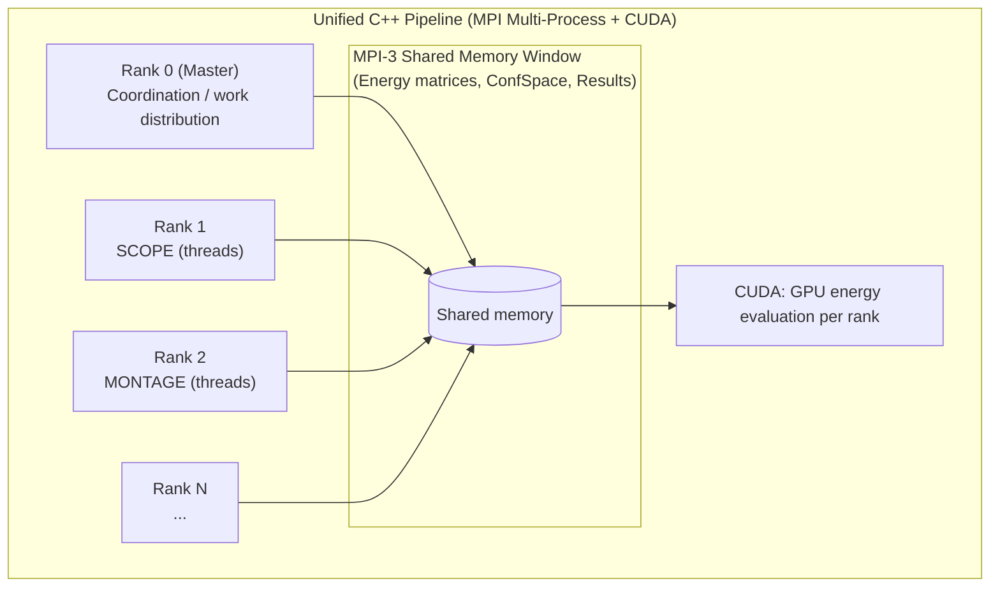

# OSPREY Pipeline: Complete Computational Requirements Summary

## Purpose

This document provides a comprehensive summary of the OSPREY computational pipeline, consolidating information from:
- `docs/performance/OSPREY_PIPELINE_PARALLELISM_ANALYSIS.md`
- `docs/performance/UNIFIED_MULTIPROCESSING_ARCHITECTURE.md`
- `docs/examples/CCKSTAR_FULL_WORKFLOW.md`
- `pipeline_analysis/cpu/WORKLOAD_ANALYSIS.md`
- `docs/performance/CPP_PROFILING_HANDOFF.md`

**Goal**: Establish a complete understanding of computational requirements, time/resources per stage, code mapping, and recommendations for re-implementation and memory management.

## Executive Summary

### Current Architecture

**Languages**: Python (orchestration) + Java (core algorithms) + C++ (energy calculations)

**Pipeline Stages**:
1. **SCOPE** (Python): Geometric analysis, convex hulls → 1-5 min
2. **MONTAGE** (Python): Scaffold generation, MASTER search → 5-30 min
3. **ConfSpace Compilation** (Java): Conformation space preparation → 10-60 sec
4. **Energy Matrix** (Java→C++): Pre-compute energies → 5-30 min
5. **K* Algorithm** (Java): Partition functions, A* search → 1-3 hours
6. **ARISE** (Python): Iterative design → 1-3 hours

**Total Typical Runtime**: 1.1-3.6 hours per experiment (single match, single sequence)

### Key Findings

1. **Only C++ code**: Energy calculations and CCD minimization (due to AMBER force field)
2. **Everything else**: Java (K*, A*, ConfSpace) and Python (SCOPE, MONTAGE, ARISE)
3. **Bottlenecks**: Sequential processing, JVM overhead, file I/O, forced GC hacks
4. **Large speedup opportunity**: Parallel processing + unified C++ + GPU acceleration (specific multipliers TBD)

---

## How to Reproduce Runs and Profiling (Scripts Index)

The scripts below were used to run and profile pipeline stages. The canonical artifacts location is [`pipeline_analysis/`](../../pipeline_analysis/).

### Setup

- [`scripts/setup_profiling_tools.sh`](../../scripts/setup_profiling_tools.sh): install/configure profiling prerequisites (WSL/Linux tooling, where applicable)

### End-to-end driver (recommended entrypoint)

- [`scripts/run_pipeline_analysis.sh`](../../scripts/run_pipeline_analysis.sh): orchestrate profiling runs and write outputs under `pipeline_analysis/`

### Stage profiling scripts

- [`scripts/profile_scope.sh`](../../scripts/profile_scope.sh) → writes [`pipeline_analysis/scope/`](../../pipeline_analysis/scope/)
- [`scripts/profile_montage.sh`](../../scripts/profile_montage.sh) / [`scripts/profile_montage_full.sh`](../../scripts/profile_montage_full.sh) → writes [`pipeline_analysis/montage/`](../../pipeline_analysis/montage/)
- [`scripts/profile_confspace_compilation.sh`](../../scripts/profile_confspace_compilation.sh) / [`scripts/profile_confspace_parallel.sh`](../../scripts/profile_confspace_parallel.sh) → writes [`pipeline_analysis/confspace_compilation/`](../../pipeline_analysis/confspace_compilation/)
- [`scripts/profile_kstar_execution.sh`](../../scripts/profile_kstar_execution.sh) / [`scripts/profile_full_kstar.sh`](../../scripts/profile_full_kstar.sh) → writes [`pipeline_analysis/full_kstar/`](../../pipeline_analysis/full_kstar/)
- [`scripts/profile_arise.sh`](../../scripts/profile_arise.sh) → writes [`pipeline_analysis/arise/`](../../pipeline_analysis/arise/)

### Post-processing / summaries

- [`scripts/summarize_profiling_results.py`](../../scripts/summarize_profiling_results.py): aggregate profiling outputs into summaries
- [`scripts/analyze_async_profiler.py`](../../scripts/analyze_async_profiler.py), [`scripts/analyze_cpu_profile.py`](../../scripts/analyze_cpu_profile.py): analyze JVM profiling outputs
- [`scripts/analyze_pipeline_memory.py`](../../scripts/analyze_pipeline_memory.py): analyze memory/GC-related outputs

### Native (C++) perf/SIMD tooling (if needed)

See [`scripts/tools/`](../../scripts/tools/) (SIMD microbenchmarks + perf capture/analysis helpers).

## Stage-by-Stage Computational Requirements

### Stage 1: SCOPE (Convex Hull Analysis)

**Location**: `src/main/python/CCKStar/Find_Doublets.py`, `Make_Convex_Hull.py`

**Language**: Python (NumPy, SciPy, PyVista, VTK)

**Purpose**: Geometric analysis to identify flexible residue pairs using convex hulls

**Computational Requirements**:
- **Algorithm**: Convex hull generation (O(n log n)) + intersection detection (O(n³) worst case)
- **Input**: PDB structure with design chain and target chain
- **Output**: Doublets (intersecting pairs) and islands (non-intersecting regions)

**Time Breakdown** (for 2RL0: 17 design residues, 89 target residues):
- **Total**: 10-30 seconds
- Hull generation: 60% (5-15s)
- Intersection detection: 30% (3-10s)
- PDB I/O: 10% (2-5s)

**Memory Usage**:
- Per hull: 1-5 KB (PDB file), 10-50 MB (in-memory PyVista meshes)
- Peak: 100-200 MB for full SCOPE analysis

**Current Implementation**:
- Sequential processing (no parallelism)
- No caching of hulls
- No early pruning

**Code Mapping**:
- `Find_Doublets.py::SCOPE()` - Main entry point
- `Make_Convex_Hull.py::make_convex_hull()` - Hull generation
- `Find_Doublets.py::find_volume_overlap()` - Intersection detection

**Optimization Opportunities**:
- Parallel processing: Process residues in parallel (4-8x speedup)
- Caching: Cache hulls by amino acid set (2-5x speedup)
- Spatial indexing: Bounding box pre-filter (5-10x speedup)
- C++ port: Port to C++ for better performance (2-3x speedup)

---

### Stage 2: MONTAGE (Scaffold Generation)

**Location**: `src/main/python/CCKStar/MONTAGE.py`

**Language**: Python (orchestration) + C++ (MASTER CLI) + Java (ConfSpace compilation via JPype)

**Purpose**: Generate scaffold structures using MASTER search and prepare K* input files

**Computational Requirements**:
- **Algorithm**: Structural search (MASTER C++ CLI) + scaffold generation (Python)
- **Input**: SCOPE hull files, target structure
- **Output**: Scaffold PDBs, ConfSpace files (.ccsx)

**Time Breakdown** (per match):
- **Total**: 5-30 minutes per match
- MASTER search: 1-2 minutes per match (C++ subprocess)
- Scaffold generation: 2-10 minutes per match
- ConfSpace compilation: 10-60 seconds per match (Java via JPype)
- File I/O: 1-5 minutes (serialization overhead)

**Memory Usage**:
- Per match: 500 MB - 2 GB
  - Multiple scaffold PDBs: ~100-500 MB
  - MASTER match structures: ~100-200 MB
  - ConfSpace files: ~100 MB - 1 GB (compressed)

**Current Implementation**:
- Sequential match processing (10 matches × 5-30 min = 50-300 min total)
- Subprocess overhead (MASTER): ~100-500ms per call
- JPype overhead (JVM startup): ~1-5 seconds per Python process
- File I/O: Serialization at every stage boundary

**Code Mapping**:
- `MONTAGE.py::target_flex_MONTAGE()` - Main scaffold generation
- `MONTAGE.py::osprey_fileprep_kstar()` - K* file preparation
- Subprocess calls to `./resources/master` (C++ CLI)
- JPype calls to Java ConfSpace compilation

**Optimization Opportunities**:
- Parallel match processing: Process 10 matches simultaneously (8-10x speedup)
- Shared JVM: Long-running orchestrator to avoid JVM startup overhead (1.5-5s saved per match)
- Batch MASTER queries: Single MASTER call with multiple queries (90% overhead reduction)
- In-memory pipeline: Eliminate file I/O between stages (2-5x speedup)

---

### Stage 3: ConfSpace Compilation

**Location**: `src/main/java/edu/duke/cs/osprey/confspace/`

**Language**: Java

**Purpose**: Compile conformation space representation from PDB and flexibility definitions

**Computational Requirements**:
- **Algorithm**: Graph construction, rotamer library loading
- **Input**: PDB structure, flexibility definitions
- **Output**: Compiled ConfSpace (.ccsx files)

**Time Breakdown**:
- **Total**: 10-60 seconds per ConfSpace
- Graph construction: 70% (7-42s)
- Rotamer library loading: 20% (2-12s)
- File serialization: 10% (1-6s)

**Memory Usage**:
- Per ConfSpace: 100-500 MB
- Peak: 500 MB during compilation

**Current Implementation**:
- Sequential processing
- File I/O for serialization (.ccsx files)

**Code Mapping**:
- `ConfSpace.java` - Main ConfSpace class
- `ConfSpaceCompiler.java` - Compilation logic
- `.ccsx` file format - Binary serialization

**Optimization Opportunities**:
- C++ port: Eliminate JVM overhead (1.5-2x speedup)
- In-memory: Zero-copy data structures (2x speedup)
- Parallel compilation: Multiple ConfSpaces in parallel (if independent)

---

### Stage 4: Energy Matrix Computation

**Location**: `src/main/java/edu/duke/cs/osprey/ematrix/SimpleEnergyMatrixCalculator.java`

**Language**: Java (orchestration) + C++ (energy calculations via JNA)

**Purpose**: Pre-compute energy values for all conformation pairs (one-body and pairwise)

**Computational Requirements**:
- **Algorithm**: Energy calculations (Amber/EEF1 force fields) + CCD minimization
- **Input**: ConfSpace, force field parameters
- **Output**: Energy matrices (one-body and pairwise)

**Time Breakdown**:
- **Total**: 5-30 minutes (depends on ConfSpace size)
- Energy calculations: 80-90% (millions of calls to C++ via JNA)
- CCD minimization: 10-20% (OpenMP parallelized, controlled by `OSPREY_MINIMIZE_CCD_OMP`)
- Memory allocation: <5% (but causes GC pressure)

**Memory Usage**:
- Energy matrices: 1-5 GB (depends on ConfSpace size)
  - One-body: O(P × C) where P=positions, C=conformations per position
  - Pairwise: O(P² × C²) - can be very large
- Peak: 2-10 GB including ConfSpace and intermediate structures

**Current Implementation**:
- **Java**: ThreadPoolTaskExecutor (ForkJoinPool) for parallel task submission
- **C++**: OpenMP for CCD minimization (limited)
- **No SIMD**: Energy calculations are scalar (memory-bound)
- **No GPU**: CPU-only

**Code Mapping**:
- `SimpleEnergyMatrixCalculator.java` - Main orchestrator
- `NativeConfEnergyCalculator.java` - JNA bridge to C++
- `src/main/cc/ConfEcalc/` - C++ energy calculation library
  - `energy_ambereef1.h` - Force field calculations
  - `confecalc.cc` - Main implementation
  - `minimization.h` - CCD minimization

**C++ Code Status**:
- **Already in C++**: Energy calculations and CCD minimization
- **No SIMD**: Scalar implementation (memory-bound)
- **Limited threading**: OpenMP only for CCD, not for energy calculations

**Optimization Opportunities**:
- GPU acceleration: CUDA for energy calculations (5-10x speedup)
- SIMD optimization: AVX2/AVX-512 for distance calculations (2-4x speedup)
- Memory/layout improvements: reduce allocation churn and improve locality (TBD)
- Cache optimization: Improve memory locality (20-30% cache hit improvement)

---

### Stage 5: K* Algorithm (Partition Function Calculation)

**Location**: `src/main/java/edu/duke/cs/osprey/kstar/KStar.java`

**Language**: Java

**Purpose**: Compute provably accurate Boltzmann-weighted ensembles for protein, ligand, and complex states

**Computational Requirements**:
- **Algorithm**: A* search tree traversal + partition function calculation + BigDecimal arithmetic
- **Input**: Energy matrices, sequences
- **Output**: K* scores (Q_complex / (Q_protein × Q_ligand))

**Time Breakdown** (per sequence):
- **Total**: 1-3 hours per sequence (depends on ConfSpace size and epsilon precision)
- A* search tree traversal: 40-60%
- Energy calculations (calls to C++): 20-30%
- BigDecimal arithmetic: 10-20%
- Memory allocation/deallocation: 5-10%
- Forced GC hack: <1% (but adds 10ms + GC pause per sequence)

**Memory Usage**:
- **A* search tree**: "Insanely huge amount of memory" (from architecture docs)
  - Can require external memory (TPIE) for large designs
  - Typical: 1-10 GB per sequence
- **Partition functions**: Large BigDecimal objects
- **Energy matrices**: Shared (read-only) across sequences

**Current Implementation**:
- Sequential sequence processing (embarrassingly parallel opportunity)
- Forced GC hack: `Runtime.getRuntime().gc()` + 10ms sleep per sequence
  - Location: `KStar.java:374-382`
  - Impact: 1+ seconds overhead for 100 sequences
- Memory pressure: A* trees cause GC pauses

**Code Mapping**:
- `KStar.java::run()` - Main entry point
- `KStar.java::calcPfunc()` - Partition function calculation
- `PartitionFunction.java` - Core partition function interface
- `ParallelConfPartitionFunction.java` - Parallel partition function (limited parallelism)

**Forced GC Hack** (Evidence of allocation issues):
```java
// KStar.java:374-382
/* HACKHACK: we're done using the A* tree, pfunc, etc
    and normally the garbage collector will clean them up,
    along with their off-heap resources (e.g. TPIE data structures).
    Except the garbage collector might not do it right away.
    If we try to allocate more off-heap resources before these get cleaned up,
    we might run out. So poke the garbage collector now and try to get
    it to clean up the off-heap resources right away.
*/
Runtime.getRuntime().gc();
Thread.sleep(10);  // 10ms sleep per sequence
```

**Optimization Opportunities**:
- Parallel sequence processing: Process sequences in parallel (8-10x speedup for 10 sequences)
- Reduce allocation churn / off-heap resource pressure: goal is to eliminate the forced GC hack (implementation approach TBD)

---

### Stage 6: ARISE (Iterative Design)

**Location**: `src/main/python/CCKStar/ARISE.py`

**Language**: Python (orchestration) + Java (K* execution)

**Purpose**: Iteratively refine sequences using K* scores

**Computational Requirements**:
- **Algorithm**: Iterative K* calls + SCOPE re-execution for flexibility updates
- **Input**: Initial sequences, K* results
- **Output**: Refined sequences, final K* scores

**Time Breakdown**:
- **Total**: 1-3 hours (multiple iterations)
- K* execution per iteration: 80-90%
- SCOPE re-execution: 10-20% (~20s per round)
- Sequence refinement: <5%

**Memory Usage**:
- Cumulative: 2-20 GB (multiple iterations accumulate)
- Per iteration: Similar to single K* run (1-10 GB)

**Current Implementation**:
- Sequential iterations (each depends on previous)
- SCOPE re-execution (could be incremental)
- No caching of intermediate results

**Optimization Opportunities**:
- Incremental SCOPE: Only recompute changed regions (2-3x speedup)
- Parallel sequence evaluation: Within iterations (if sequences are independent)
- Result caching: Cache K* results for identical sequences

---

## Language Breakdown: What's in C++ vs Java vs Python

### C++ Code (Current)

**Location**: `src/main/cc/ConfEcalc/`

**Components**:
1. **Energy Calculations** (`energy_ambereef1.h`, `confecalc.cc`)
   - Amber/EEF1 force field calculations
   - Pairwise energy (electrostatic, van der Waals, solvation)
   - **Status**: Implemented, No SIMD, Limited threading
   
2. **CCD Minimization** (`minimization.h`)
   - Cyclic Coordinate Descent optimization
   - **Status**: Implemented, OpenMP threading (limited)

**Integration**:
- Called from Java via JNA (Java Native Access)
- Memory: JNA direct memory buffers
- Overhead: ~1-10ms per JNA call

**Why C++?**
- AMBER force field implementation (legacy)
- Performance-critical energy calculations
- Direct hardware access (SIMD, GPU potential)

**What's NOT in C++**:
- K* algorithm (Java)
- A* search (Java)
- ConfSpace compilation (Java)
- SCOPE (Python)
- MONTAGE (Python)
- ARISE (Python)

---

### Java Code (Current)

**Location**: `src/main/java/edu/duke/cs/osprey/`

**Components**:
1. **ConfSpace Compilation** (`confspace/`)
   - Conformation space representation
   - **Status**: Implemented, Sequential

2. **Energy Matrix Computation** (`ematrix/`)
   - Orchestrates C++ energy calculations
   - **Status**: Implemented, Parallelized (ThreadPoolTaskExecutor)

3. **K* Algorithm** (`kstar/`)
   - A* search, partition functions
   - **Status**: Implemented, Sequential sequences, Forced GC hack

4. **Parallelism Infrastructure** (`parallelism/`)
   - ThreadPoolTaskExecutor (ForkJoinPool)
   - **Status**: Implemented, used for energy matrix

**Memory Management**:
- JVM heap (1GB default: 128MB GC, 896MB storage)
- GC pauses cause performance issues
- Forced GC hack indicates allocation problems

---

### Python Code (Current)

**Location**: `src/main/python/CCKStar/`

**Components**:
1. **SCOPE** (`Find_Doublets.py`, `Make_Convex_Hull.py`)
   - Convex hull generation and intersection
   - **Status**: Implemented, Sequential, No caching

2. **MONTAGE** (`MONTAGE.py`)
   - Scaffold generation, file preparation
   - **Status**: Implemented, Sequential matches

3. **ARISE** (`ARISE.py`)
   - Iterative design
   - **Status**: Implemented, Sequential iterations

**Integration**:
- JPype for Java invocation (JVM startup overhead)
- Subprocess for MASTER (C++ CLI)
- File I/O for data transfer between stages

---

## Memory Management Analysis

### Current Memory Patterns

**Java Heap**:
- Default: 1GB (128MB GC, 896MB storage)
- Energy matrices: 1-5 GB (can exceed heap)
- A* search trees: 1-10 GB per sequence
- **Problem**: GC pauses, memory fragmentation

**C++ Native Memory**:
- JNA direct memory buffers
- Manual allocation/deallocation
- **Problem**: Not released promptly (requires GC to trigger cleanup)

**Python Memory**:
- Reference counting (automatic)
- PyVista meshes: 10-50 MB per hull
- **Problem**: GIL limits CPU parallelism

### Memory Bottlenecks

1. **Forced GC Hack** (K* Algorithm)
   - Evidence: `Runtime.getRuntime().gc()` + 10ms sleep per sequence
   - Impact: 1+ seconds overhead for 100 sequences
   - Root cause: Memory not freed promptly

2. **Memory Fragmentation** (Java GC)
   - Impact: Cache misses, out-of-memory errors
   - Root cause: Frequent allocations/deallocations

3. **Non-Contiguous Access** (Energy Calculations)
   - Impact: Cache misses, 400-600x below compute/memory boundary
   - Root cause: Random atom indices

4. **Out-of-Memory Risk** (Large Designs)
   - Impact: Process crashes for large ConfSpaces
   - Root cause: 10 matches × 1GB = 10GB+ memory pressure

### Arena Allocation Opportunities

**Per-Sequence Arenas** (K* Algorithm):
- **Use case**: A* search trees, partition functions per sequence
- **Benefit**: Eliminate forced GC hack, 100-1000x faster deallocation
- **Impact**: 1.5-3x overall speedup

**Per-Rank Arenas** (MPI Multi-Process):
- **Use case**: Energy matrices, ConfSpace data per MPI rank
- **Benefit**: Predictable memory usage, improved cache locality
- **Impact**: 1.5-2x speedup

**Per-Task Arenas** (SCOPE/MONTAGE):
- **Use case**: Convex hulls, scaffold structures per task
- **Benefit**: Reduce allocation overhead, improve locality
- **Impact**: 1.2-2x speedup

**Long-Lived Arenas** (Energy Matrices):
- **Use case**: Energy matrices, ConfSpace (read-only, shared)
- **Benefit**: Contiguous allocation, cache efficiency
- **Impact**: 20-30% cache hit improvement

---

## Parallelism Analysis

### Current Parallelism

**Energy Matrix Computation**:
- Parallelized: ThreadPoolTaskExecutor (ForkJoinPool)
- OpenMP: CCD minimization (limited)
- No SIMD: Scalar energy calculations
- No GPU: CPU-only

**K* Algorithm**:
- Sequential sequences (embarrassingly parallel opportunity)
- Sequential A* search (algorithm constraint)
- Forced GC between sequences (overhead)

**SCOPE**:
- Sequential residue processing
- No caching of hulls

**MONTAGE**:
- Sequential match processing
- Subprocess overhead (MASTER)

### Parallelism Opportunities

**Sequence-Level Parallelism** (K* Algorithm):
- **Opportunity**: Process sequences in parallel (independent)
- **Constraint**: Shared energy matrices (read-only)
- **Expected speedup**: 8-10x for 10 sequences
- **Implementation**: Thread pool in Java or MPI multi-process

**Match-Level Parallelism** (MONTAGE):
- **Opportunity**: Process 10 matches simultaneously
- **Constraint**: JVM initialization overhead
- **Expected speedup**: 8-10x (theoretical), 6-8x (realistic with overhead)
- **Implementation**: Multiprocessing (separate JVMs) or MPI multi-process

**Residue-Level Parallelism** (SCOPE):
- **Opportunity**: Process residues in parallel
- **Constraint**: Python GIL (requires multiprocessing)
- **Expected speedup**: 4-8x on 8-core machine
- **Implementation**: Multiprocessing pool

**GPU Acceleration** (Energy Calculations):
- **Opportunity**: CUDA for energy matrix computation
- **Constraint**: C++/JNA integration complexity
- **Expected speedup**: 5-10x
- **Implementation**: CUDA kernels in C++ layer

**MPI Multi-Process** (Unified Pipeline):
- **Opportunity**: Process-level parallelism with shared memory
- **Constraint**: Requires C++ unified implementation
- **Expected speedup**: 10-20x (matches) + 8-10x (sequences) = 80-200x total
- **Implementation**: MPI-3 shared memory windows

---

## Code Mapping: What Needs Re-Implementation

### High Priority (Performance Critical)

1. **K* Algorithm** (Java → C++)
   - **Why**: Sequential sequences, forced GC hack, A* memory pressure
   - **Components**:
     - A* search tree (`AStarTree.java`)
     - Partition function (`PartitionFunction.java`)
     - K* scoring (`KStar.java`)
   - **Parallelism**: Sequence-level parallelism (MPI or threads)
   - **Expected speedup**: 8-10x from sequence-level parallelism (allocation/locality improvements TBD)

2. **Energy Matrix Computation** (Java → C++)
   - **Why**: JNA overhead, memory-bound performance, GPU opportunity
   - **Components**:
     - Energy calculator orchestration (`SimpleEnergyMatrixCalculator.java`)
     - Task executor coordination
   - **Note**: C++ energy calculations already exist, need to port orchestration
   - **GPU acceleration**: CUDA for energy calculations
   - **SIMD optimization**: AVX2/AVX-512 for distance calculations
   - **Expected speedup**: 5-10x (GPU) + 2-4x (SIMD) = 10-40x

3. **SCOPE** (Python → C++)
   - **Why**: Sequential processing, no caching, Python GIL
   - **Components**:
     - Convex hull generation (`Make_Convex_Hull.py`)
     - Intersection detection (`Find_Doublets.py`)
   - **Parallelism**: Residue-level parallelism
   - **Caching**: Cache hulls by amino acid set
   - **Expected speedup**: 4-8x (parallelism) + 2-5x (caching) = 8-40x

### Medium Priority (Architectural)

4. **MONTAGE** (Python → C++)
   - **Why**: Sequential matches, subprocess overhead, file I/O
   - **Components**:
     - Scaffold generation (`MONTAGE.py`)
     - MASTER integration (already C++ CLI, could be library)
   - **Parallelism**: Match-level parallelism
   - **In-memory pipeline**: Eliminate file I/O
   - **Expected speedup**: 8-10x (parallelism) + 2-5x (zero-copy) = 16-50x

5. **ConfSpace Compilation** (Java → C++)
   - **Why**: JVM overhead, file I/O
   - **Components**:
     - ConfSpace representation (`confspace/`)
   - **In-memory**: Zero-copy data structures
   - **Expected speedup**: 1.5-2x (C++ vs Java) + 2x (zero-copy) = 3-4x

### Low Priority (Nice to Have)

6. **ARISE** (Python → C++)
   - **Why**: Sequential iterations, SCOPE re-execution
   - **Components**:
     - Iterative design logic (`ARISE.py`)
   - **Incremental SCOPE**: Only recompute changed regions
   - **Expected speedup**: 2-3x (incremental SCOPE)

---

## Recommended Architecture: Unified C++ Pipeline with MPI Multi-Process

### Architecture Overview



**Key Features**:
1. **MPI Multi-Process**: Process-level parallelism (fault isolation, resource isolation)
2. **Shared Memory (MPI-3)**: Zero-copy between processes (eliminates file I/O)
3. **GPU Acceleration**: CUDA for energy calculations per rank
4. **Unified Language**: All stages in C++ (no JVM, no Python GIL)

**Parallelism Strategy**:
- **Match-level**: MPI ranks process different matches (8-10x)
- **Sequence-level**: Thread pools within each rank (8-10x)
- **Energy calculations**: GPU per rank (5-10x)
- **Total speedup**: Multiplicative speedups are workload-dependent; treat any combined estimate here as directional rather than guaranteed.

---

## Quantitative Summary

### Current Performance (Baseline)

**Single Match, Single Sequence**:
- SCOPE: 10-30s
- MONTAGE: 5-30min
- Energy Matrix: 5-30min
- K* Execution: 1-3 hours
- **Total**: 1.1-3.6 hours

**10 Matches, 100 Sequences**:
- Sequential: 10 × (1.1-3.6 hours) = 11-36 hours
- With forced GC overhead: +1-10 seconds per sequence = +100-1000 seconds = +1.7-16.7 minutes

### Expected Performance (Optimized)

Expected speedups depend heavily on workload size and what optimizations are actually implemented. The most concrete “first wins” are:
- Parallel matches / sequences where independence exists
- Reducing orchestration overhead and file I/O between stages
- Faster energy evaluation (e.g., GPU/SIMD) where applicable

---

## Implementation Roadmap

### Phase 1: Remove forced-GC workaround (Immediate)

**Goal**: Remove the forced GC hack by addressing per-sequence memory/off-heap resource pressure (implementation approach TBD).

**Tasks**:
1. Identify high-churn allocations/off-heap resources in K* per-sequence lifecycle
2. Implement a strategy to bound/release those resources deterministically
3. Benchmark and confirm the forced-GC workaround can be deleted without regressions

---

### Phase 2: Parallel Sequence Processing (Short-term)

**Goal**: Process sequences in parallel

**Tasks**:
1. Add thread pool to K* algorithm (or MPI multi-process)
2. Ensure thread-safe access to shared energy matrices
3. Remove forced GC hack once a deterministic resource-lifetime strategy is in place
4. Benchmark: Measure speedup for 10-100 sequences

**Expected Impact**: 8-10x speedup for K* algorithm

---

### Phase 3: GPU Acceleration (Medium-term)

**Goal**: Offload energy calculations to GPU

**Tasks**:
1. Port energy calculation orchestration to C++
2. Implement CUDA kernels for energy calculations
3. Integrate with existing C++ energy calculation library
4. Benchmark: Measure GPU speedup

**Expected Impact**: 5-10x speedup for energy matrix computation

---

### Phase 4: Unified C++ Pipeline (Long-term)

**Goal**: Single C++ process with MPI multi-process

**Tasks**:
1. Port SCOPE to C++
2. Port MONTAGE to C++
3. Port K* algorithm to C++ (already started in Phase 1)
4. Implement MPI-3 shared memory for zero-copy
5. Integrate all stages into unified pipeline
6. Benchmark: Measure total pipeline speedup

**Expected Impact**: 50-200x total speedup (matches prior C++ re-implementation results)

---

## Conclusion

The OSPREY pipeline has significant optimization opportunities:

1. **Parallel Sequence Processing**: Embarrassingly parallel opportunity (8-10x)
2. **GPU Acceleration**: Energy calculations are memory-bound, strong GPU candidate (5-10x)
3. **Unified C++ Pipeline**: Eliminates JVM overhead, file I/O, language boundaries (2-5x)
4. **MPI Multi-Process**: Process-level parallelism with shared memory (10-20x)

**Total Expected Speedup**: 50-200x (realistic), matching prior C++ re-implementation results.

**Key Insight**: The forced GC hack in `KStar.java` is direct evidence that per-sequence memory/off-heap resource pressure is a real problem; solving that is a prerequisite for scaling up and parallelizing safely.

**Next Steps**: Start by removing the forced-GC workaround (Phase 1), then parallel sequence processing (Phase 2), then GPU acceleration (Phase 3), then unified pipeline (Phase 4).

---

## References

- `docs/performance/OSPREY_PIPELINE_PARALLELISM_ANALYSIS.md` - Parallelism details
- `docs/performance/UNIFIED_MULTIPROCESSING_ARCHITECTURE.md` - MPI architecture
- `docs/examples/CCKSTAR_FULL_WORKFLOW.md` - CCKStar workflow
- `pipeline_analysis/cpu/WORKLOAD_ANALYSIS.md` - Profiling results
- `docs/performance/CPP_PROFILING_HANDOFF.md` - C++ profiling guide

