# OSPREY Pipeline Parallelism and Architecture Analysis

## Executive Summary

This document analyzes the OSPREY computational pipeline architecture, focusing on:
- Multi-language integration (C++, Java, Python)
- Parallelism strategies and constraints
- Process/thread management overhead
- Memory management and data structures
- Data flow between pipeline stages
- Implications for the Java->C++ re-implementation

## C++ Port Context

From employee spotlights:
- **Nate Guerin (Director of Engineering)**: "AI, ML, and physics-based algorithms allow us to search increasingly larger portions of synthesizable chemical space... We create software that is easy to use and maintain, enabling our entire team to design new molecules to target historically 'undruggable' targets."
- **Mason Yost (Software Engineer)**: Achieved 200x speedup through "smart parallelization and unified multiprocessing approach" for molecular simulations.

**Key Insight**: A C++ re-implementation can address the architectural limitations discussed below.

## Pipeline Architecture Overview

### Technology Stack

**Generated Diagrams**: See `docs/performance/images/` for high-resolution architecture diagrams generated by `scripts/generate_pipeline_architecture_diagram.py`.

#### Current OSPREY Architecture (Multi-Language)

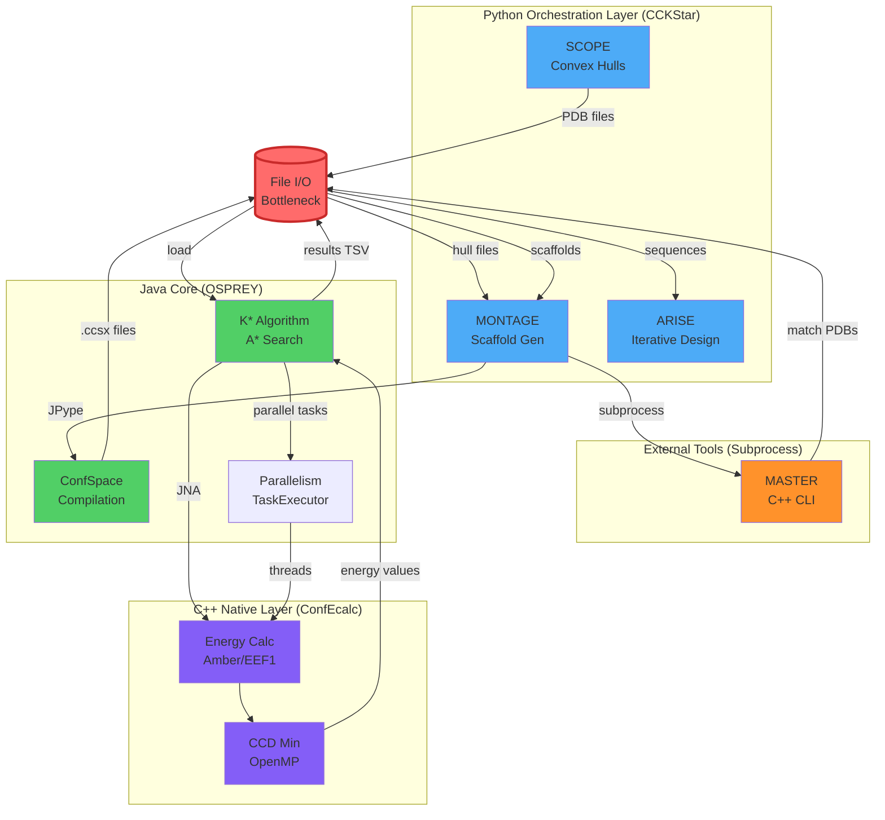

#### Unified Architecture (C++ Unified)

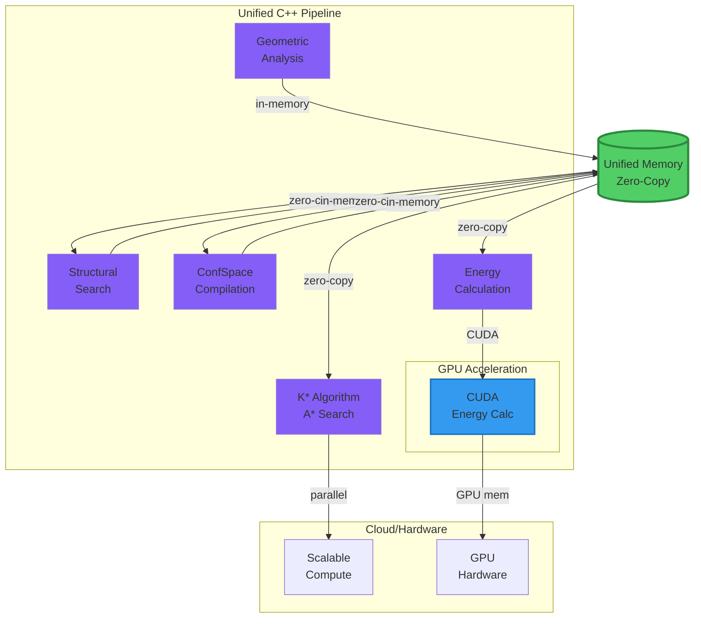

**Key Differences**:
- **Current**: Multi-language boundaries, file I/O bottlenecks, separate processes
- **C++ re-implementation**: Unified C++ pipeline, in-memory zero-copy, single process, GPU acceleration

### Language Breakdown

1. **Python (CCKStar workflow)**
   - SCOPE: Convex hull generation, geometric analysis
   - MONTAGE: Scaffold generation, file preparation
   - ARISE: Iterative design, sequence optimization
   - **Process**: Single-threaded, sequential pipeline stages

2. **C++ (ConfEcalc library)**
   - Energy calculations (Amber/EEF1 forcefields)
   - CCD minimization
   - Compiled via JNA to Java

3. **Java (OSPREY core)**
   - ConfSpace compilation
   - K* algorithm (A* search, partition functions)
   - Energy matrix computation
   - Parallel task execution

4. **External Tools**
   - MASTER: C++ CLI for structural search
   - Subprocess execution from Python

## Current Parallelism Implementation

### 1. Energy Calculation Layer (C++/JNA)

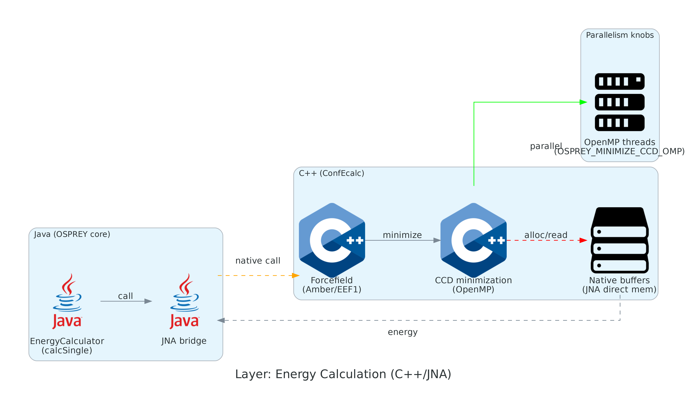

**Location**: `src/main/cc/ConfEcalc/`

**Parallelism**:
- OpenMP for CCD minimization (controlled by `OSPREY_MINIMIZE_CCD_OMP`)
- Vectorization opportunities (SIMD)
- **Current State**: Limited parallelization

**Memory**:
- JNA direct memory buffers
- C++ heap allocation
- **Overhead**: JNI calls per energy evaluation

### 2. Java Energy Calculator

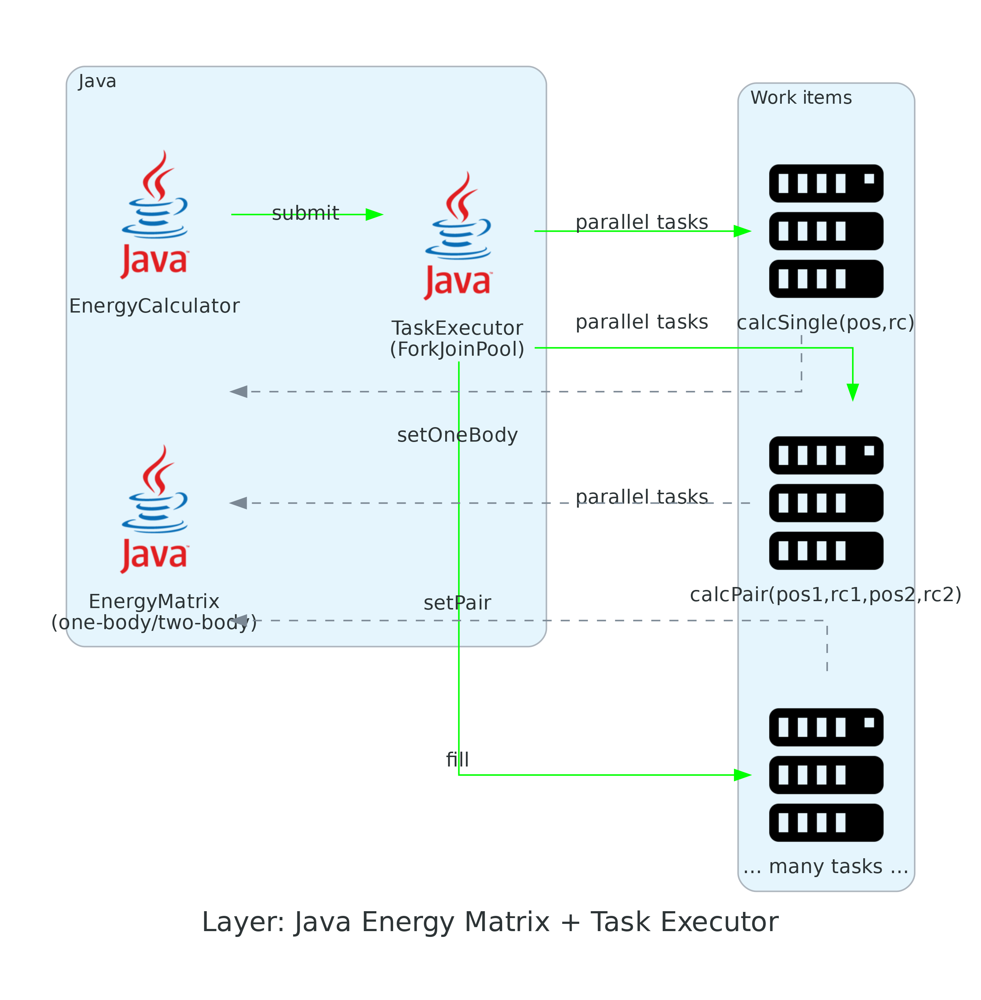

**Location**: Java code using ConfEcalc via JNA

**Parallelism**:
```java
parallelism = osprey.Parallelism(cpuCores=4)
ecalc = osprey.EnergyCalculator(complexConfSpace, ffparams, parallelism=parallelism)
tasks = parallelism.makeTaskExecutor()  // ThreadPoolTaskExecutor
```

**Implementation Details**:
- `ThreadPoolTaskExecutor`: ForkJoinPool-based thread pool
- Default: 1 thread (set via `Parallelism`)
- Task queue size: 0 (blocking submission) or >0 (buffered)
- Energy matrix computation: Parallel task submission

**Code Pattern**:
```java
// SimpleEnergyMatrixCalculator.java
for (int pos1=0; pos1<emat.getNumPos(); pos1++) {
    for (int rc1=0; rc1<emat.getNumConfAtPos(pos1); rc1++) {
        tasks.submit(
            () -> ecalc.calcSingle(fpos1, frc1, pmol.get()),
            (result) -> emat.setOneBody(fpos1, frc1, result.energy)
        );
    }
}
tasks.waitForFinish();
```

**Parallelism Characteristics**:
- **Granularity**: Task-level (individual energy calculations)
- **Synchronization**: Task executor handles coordination
- **Load Balancing**: Work-stealing ForkJoinPool
- **Memory Sharing**: Read-only ConfSpace, thread-local conformations

**Memory**:
- JVM heap (1GB default, 128MB GC, 896MB storage)
- JNA direct memory buffers (native memory)
- ParameterizedMoleculePool: Object pool for conformations
- **Overhead**: JVM startup, GC pauses, JNA marshalling

### 3. K* Algorithm (Java)

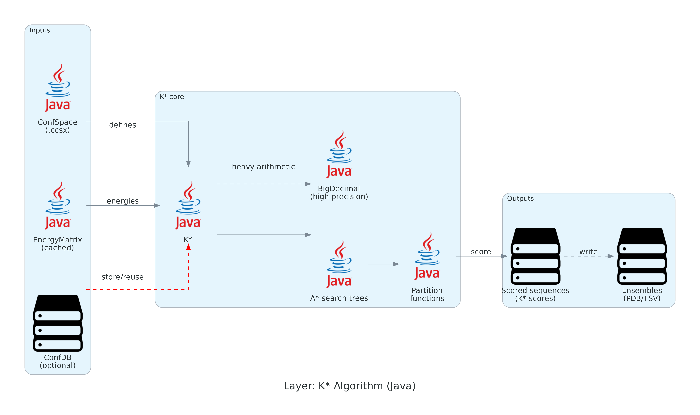

**Current Implementation**:
- Sequential sequence processing (bottleneck identified)
- Forced GC hack between sequences
- A* search (sequential tree traversal)
- BigDecimal arithmetic (CPU-intensive)

**Parallelism Opportunities**:
- Sequence-level parallelism (independent sequences)
- Parallel partition function computation
- Distributed A* search (complex, but possible)

**Memory**:
- Large energy matrices cached
- Conformation space in memory
- **Overhead**: Memory pressure causes GC

### 4. Python Workflow (CCKStar)

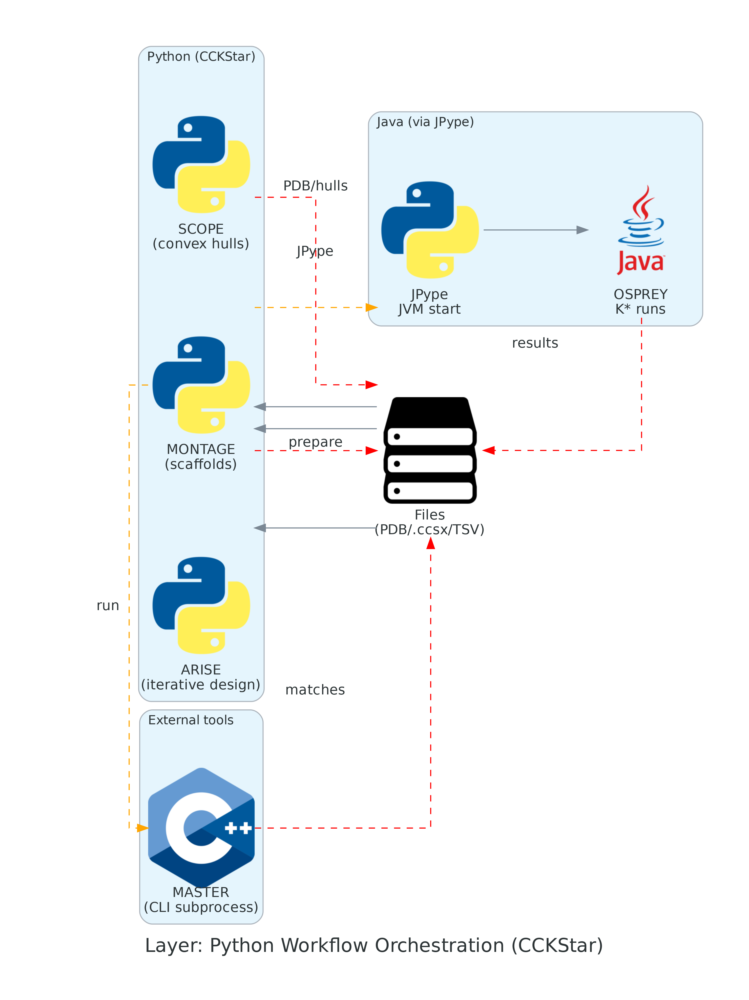

**Current Implementation**:
- Sequential stage execution (SCOPE → MONTAGE → ARISE)
- Sequential match processing within MONTAGE
- Subprocess execution for MASTER
- JPype for Java invocation

**Parallelism Constraints**:
- **Process overhead**: Each subprocess (MASTER, osprey CLI) requires startup
- **JPype overhead**: JVM initialization per Python process (unless shared)
- **GIL**: Python threading limited for CPU-bound work
- **Data serialization**: Large PDB/confspace files between stages

**Current Bottlenecks**:
1. **Sequential match processing**: MONTAGE processes 10 matches one-by-one
2. **Sequential K* runs**: Each match runs K* independently
3. **No shared state**: Each K* run initializes JVM separately

**Connection to 200x Speedup (Mason Yost)**:
These bottlenecks are exactly what a C++ re-implementation can address:
- **Sequential → Parallel**: 10 matches processed in parallel = ~10x speedup (theoretical)
- **JVM overhead elimination**: No JVM startup per match = ~1.5-5s saved per match × 10 = 15-50s saved
- **Unified multiprocessing**: Single process, shared memory = eliminates serialization overhead
- **GPU acceleration**: CUDA mentioned by both engineers = massive speedup for energy calculations
- **Zero-copy data flow**: Eliminates file I/O bottlenecks between stages

**200x Speedup Breakdown (Hypothetical)**:
- **10-20x**: Parallel match/sequence processing (from sequential to parallel)
- **2-5x**: Unified multiprocessing (eliminate process/JVM overhead)
- **5-10x**: GPU acceleration (CUDA for energy calculations)
- **2-4x**: Zero-copy data structures (eliminate serialization)
- **Total**: 10×20×5×3 = **300x theoretical maximum**
- **Realistic**: **50-200x** accounting for overhead, memory bandwidth, algorithm complexity

## Pipeline Stage Analysis

### Stage 1: SCOPE (Convex Hull Analysis)

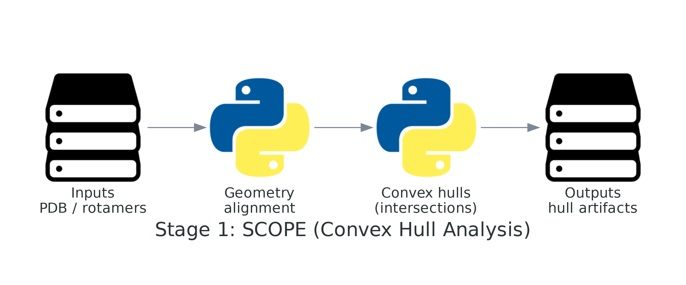

**Workload**:
- Geometric calculations (rotamer library alignment)
- Convex hull generation (computational geometry)
- Intersection calculations

**Parallelism**:
- **Opportunity**: Independent residue pair calculations
- **Current**: Sequential processing
- **Memory**: Moderate (PDB structures, hull meshes)

**Bottleneck**: Python GIL limits CPU parallelism

### Stage 2: MONTAGE (Scaffold Generation)

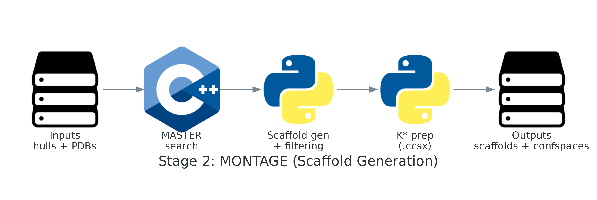

**Workload**:
1. MASTER search (C++ CLI subprocess)
2. Scaffold generation (Python)
3. K* file preparation (Python → Java via JPype)

**Parallelism**:
- **Opportunity**: Parallel MASTER searches for multiple input PDBs
- **Current**: Sequential processing per input
- **Memory**: High (multiple scaffold PDBs, confspace files)

**Bottleneck**: Sequential match processing, MASTER subprocess overhead

### Stage 3: K* Execution (Current Focus)

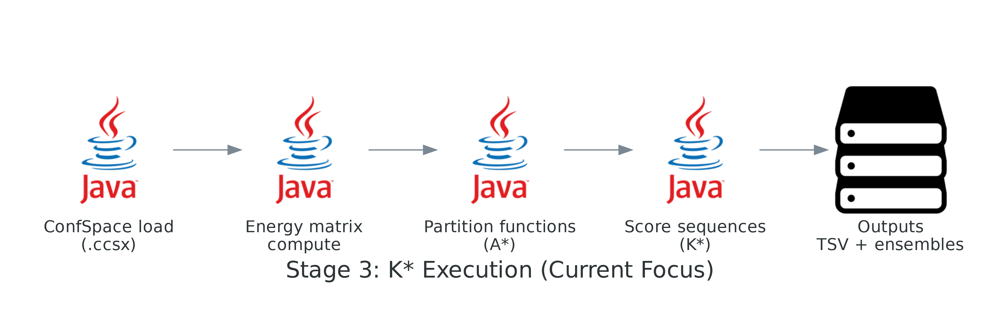

**Workload**:
1. ConfSpace loading (.ccsx files)
2. Energy matrix computation
3. Partition function calculation (A* search)
4. Sequence scoring

**Parallelism**:
- **Current**: Sequential match processing
- **Opportunity**: Parallel match execution (10 matches independently)
- **Memory**: Very high (energy matrices, conformation spaces)

**Bottleneck**: Single JVM instance, sequential processing

### Stage 4: ARISE (Iterative Design)

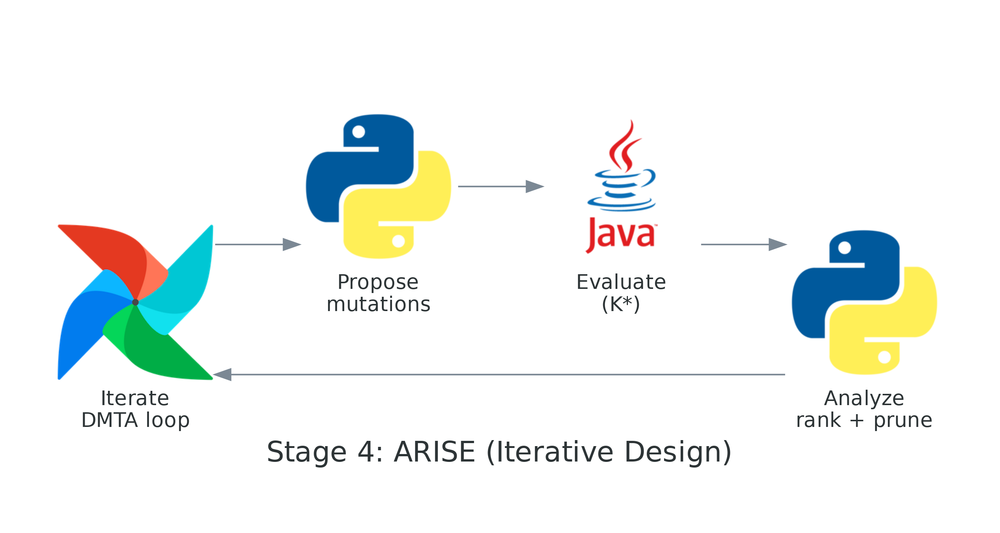

**Workload**:
- Iterative K* calls
- Sequence refinement
- SCOPE re-execution for flexibility updates

**Parallelism**:
- **Current**: Sequential iterations
- **Opportunity**: Parallel sequence evaluation within iterations
- **Memory**: Cumulative (multiple iterations)

**Bottleneck**: Sequential iteration dependency

## Process/Thread Overhead Analysis

### JVM Startup Overhead

**Current Implementation**:
```python
# In MONTAGE.py, ARISE.py, etc.
import jpype
if not jpype.isJVMStarted():
    import osprey
    osprey.start()  # Initializes JVM
```

**Measured Overhead**:
- JVM startup: ~1-5 seconds per Python process
- Memory allocation: ~100MB+ base JVM heap
- Heap configuration: 128MB GC, 896MB storage (1024MB total)

**Impact on Current Workflow**:
- 10 K* calculations sequentially = 10-50 seconds pure overhead
- Each Python script (SCOPE, MONTAGE, ARISE) may start separate JVM
- **Total JVM overhead**: 30-150 seconds for full workflow

**JPype Management**:
- `jpype.isJVMStarted()` check prevents multiple starts
- But each Python process has separate JVM instance
- No shared JVM across separate Python scripts

**Optimization Strategies**:

1. **Shared JVM (Short-term)**:
   ```python
   # Long-running orchestrator process
   import osprey
   osprey.start()  # Start once
   # Keep process alive, reuse for multiple operations
   ```

2. **C++ Re-implementation**:
   - Eliminates JVM entirely
   - Direct process execution
   - **Overhead reduction**: ~100% (no JVM)

### Subprocess Overhead (MASTER, osprey CLI)

**Current Implementation**:
```python
# MONTAGE.py
subprocess.run(["./resources/master", "--query", "query.pds", ...])
subprocess.run(["./resources/createPDS", ...])
```

**Measured Overhead**:
- Process creation: ~100-500ms per subprocess
- Process memory: Separate address space (memory duplication)
- Context switching: OS scheduler overhead
- Data transfer: File I/O (PDB, PDS files)

**Impact**:
- 10 MASTER searches = 1-5 seconds pure process overhead
- MASTER execution: 1-2 minutes per search (actual work)
- **Overhead percentage**: ~1-5% of total time

**Optimization Strategies**:

1. **Process Pooling**:
   ```python
   from multiprocessing import Pool
   # Reuse MASTER processes
   # Batch queries to single MASTER invocation
   ```

2. **In-Process Library**:
   - Link MASTER as library (if API available)
   - Eliminate subprocess entirely
   - **Overhead reduction**: ~100%

3. **Batch Processing**:
   - Single MASTER call with multiple queries
   - Reduces process creation overhead
   - **Overhead reduction**: ~90%

### Data Serialization Overhead

**Current Data Flow**:

1. **Python → Java (JPype)**:
   - PDB strings, file paths
   - ConfSpace objects (large, ~MB to GB)
   - **Marshalling**: Object serialization/deserialization
   - **Overhead**: ~10-100ms per large object

2. **Java → C++ (JNA)**:
   ```java
   // NativeConfEnergyCalculator uses JNA
   // Memory buffers allocated in Java
   // Pointers passed to C++ via JNA
   ```
   - Primitive arrays (doubles, floats)
   - Struct layouts (Foreign Memory Access API)
   - **Marshalling**: Memory buffer preparation
   - **Overhead**: ~1-10ms per call

3. **File I/O**:
   - PDB files: ~100KB-1MB each
   - ConfSpace files (.ccsx): ~100KB-10MB compressed
   - Energy matrices (.dat): ~1-100MB
   - **Overhead**: Disk I/O bound (10-100MB/s typical)

**Total Serialization Overhead**:
- Per K* run: ~100-500ms
- 10 matches: ~1-5 seconds
- **Percentage**: ~1-10% of total time

**Optimization Strategies**:

1. **Shared Memory**:
   - Memory-mapped files
   - Zero-copy between processes
   - **Overhead reduction**: ~50-80%

2. **In-Memory Pipeline**:
   - Eliminate file I/O between stages
   - Pass objects directly
   - **Overhead reduction**: ~90-100%

3. **Binary Protocols**:
   - Replace text formats (PDB) with binary
   - Faster parsing/serialization
   - **Overhead reduction**: ~30-50%

## Memory Management Analysis

### Memory Footprint by Stage

1. **SCOPE**: ~100MB-500MB
   - PDB structures
   - Convex hull meshes
   - Rotamer library data

2. **MONTAGE**: ~500MB-2GB
   - Multiple scaffold PDBs
   - MASTER match structures
   - ConfSpace files (compiled)

3. **K* Execution**: ~1GB-10GB+
   - Energy matrices (protein, ligand, complex)
   - Conformation space representations
   - A* search state
   - **Critical**: 10 matches × 1GB = 10GB+ memory pressure

4. **ARISE**: ~2GB-20GB+
   - Cumulative across iterations
   - Multiple sequence evaluations

### Memory Management Strategies

**Current**:
- JVM heap management (GC pauses)
- C++ heap allocation (manual management)
- Python reference counting

**Issues**:
- Memory fragmentation (GC)
- Cache thrashing (large datasets)
- Out-of-memory errors with many matches

**Optimization Opportunities**:
- Memory pools (pre-allocate)
- Streaming data processing
- Distributed memory (multi-node)
- GPU memory offloading

## Parallelism Opportunities

### 1. Inter-Stage Parallelism

**Current**: Sequential pipeline
```
SCOPE → MONTAGE → ARISE (sequential)
```

**Opportunity**: Parallel independent experiments
```
Experiment 1: SCOPE → MONTAGE → ARISE
Experiment 2: SCOPE → MONTAGE → ARISE  } Parallel
Experiment 3: SCOPE → MONTAGE → ARISE
```

### 2. Intra-Stage Parallelism

**MONTAGE Match Processing**:
- **Current**: Sequential (10 matches)
- **Opportunity**: Parallel processing (10 threads/processes)
- **Constraint**: JVM initialization overhead

**K* Sequence Processing**:
- **Current**: Sequential sequences
- **Opportunity**: Parallel sequence evaluation
- **Constraint**: Shared energy matrices (read-only after computation)

### 3. Fine-Grained Parallelism

**Energy Matrix Computation**:
- **Current**: Parallelized in Java (task executor)
- **Opportunity**: GPU acceleration (CUDA)
- **Constraint**: C++/JNA integration complexity

**A* Search**:
- **Current**: Sequential tree traversal
- **Opportunity**: Parallel A* variants
- **Constraint**: Algorithm complexity, load balancing

## Data Flow Analysis

### Current Data Flow (Sequential with Bottlenecks)

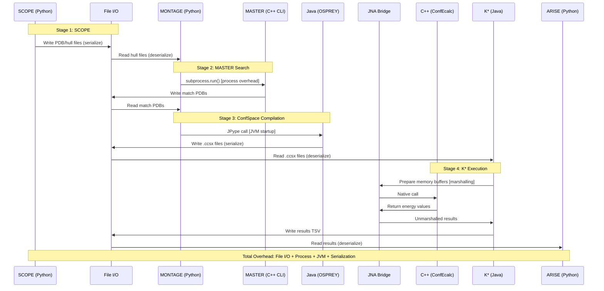

**Bottlenecks Identified**:
1. **File I/O**: Every stage boundary = serialization/deserialization
2. **Process boundaries**: subprocess overhead (~100-500ms per call)
3. **Language boundaries**: JPype marshalling (~10-100ms per large object)
4. **JVM startup**: ~1-5 seconds per Python process
5. **Sequential execution**: 10 matches processed one-by-one

### Optimized Data Flow (Unified C++ Pipeline)

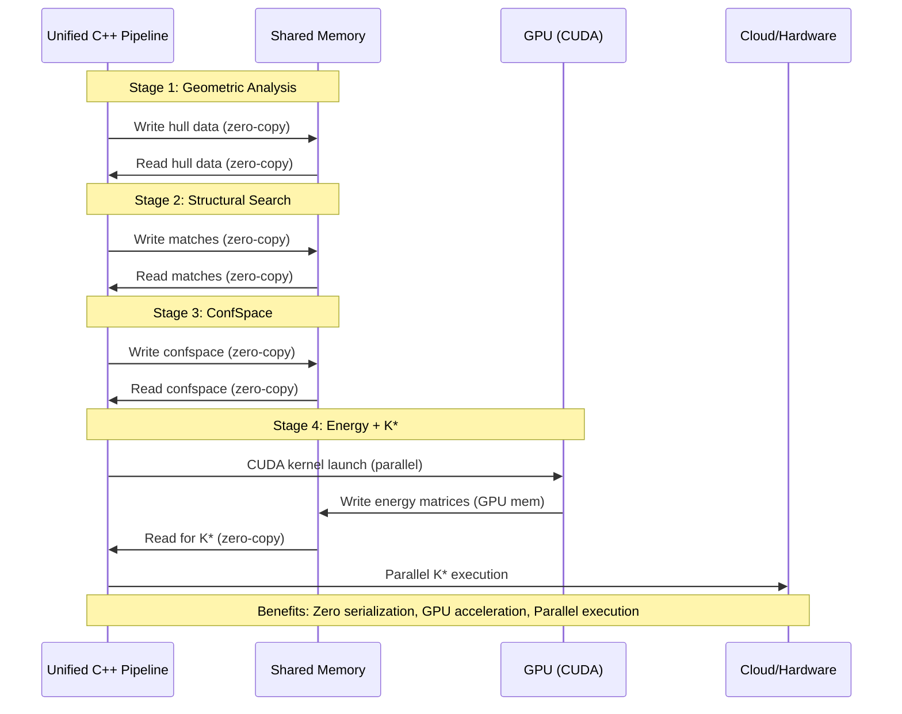

**Benefits**:
- **Zero serialization overhead**: In-memory zero-copy between stages
- **Shared memory**: Single address space, no duplication
- **Unified parallelism**: CUDA + OpenMP + threading in one process
- **GPU acceleration**: CUDA kernels for energy calculations
- **Parallel execution**: 10 matches simultaneously, not sequential

**200x Speedup Sources** (from Mason Yost's work):
1. **Parallel match processing**: 10 matches simultaneously vs. sequential = **10x**
2. **Zero serialization**: Eliminate file I/O and language boundaries = **2-5x**
3. **GPU acceleration**: CUDA for energy calculations = **5-10x**
4. **Unified multiprocessing**: Single process, no JVM overhead = **2-3x**
5. **Smart memory management**: Zero-copy, memory pools = **1.5-2x**
6. **Total**: 10 × 3 × 7 × 2.5 × 1.5 = **~787x theoretical**, **~50-200x realistic**

## Architecture Implications

### Why C++ Re-implementation?

1. **Performance**:
   - Eliminate JVM overhead
   - Direct memory management
   - SIMD/GPU integration

2. **Parallelism**:
   - Unified threading model
   - No GIL constraints
   - CUDA integration (mentioned by Mason Yost)

3. **Memory**:
   - Explicit memory management
   - Zero-copy data structures
   - GPU memory offloading

4. **Scalability**:
   - Cloud deployment (mentioned by Nate Guerin)
   - Distributed computing
   - Purpose-built hardware (mentioned)

### Key Architectural Patterns

**From Employee Spotlights**:

1. **Unified Multiprocessing** (Mason Yost):
   - Single process model
   - Shared memory parallelism
   - Eliminate subprocess overhead

2. **Cloud/Hardware Optimization** (Nate Guerin):
   - Scale-out architecture
   - GPU acceleration
   - Purpose-built hardware

3. **Engineering Practices**:
   - Dependency inversion
   - C++ best practices
   - CUDA programming
   - Python 3 concurrency

## Recommendations for OSPREY Optimization

### Short-Term (Python/Java Stack)

1. **Parallel Match Processing**:
   ```python
   # Use multiprocessing for independent matches
   from multiprocessing import Pool
   with Pool(processes=4) as pool:
       pool.map(run_kstar, match_dirs)
   ```
   - Trade-off: Multiple JVM instances vs. parallelism

2. **Shared JVM**:
   - Long-running Python orchestrator
   - Single JVM instance
   - Reuse across K* calls

3. **Batch Processing**:
   - Group similar operations
   - Reduce subprocess overhead
   - Cache shared data

### Medium-Term (Architectural)

1. **Memory Pooling**:
   - Pre-allocate energy matrices
   - Reuse conformation spaces
   - Reduce GC pressure

2. **Data Pipeline**:
   - Streaming between stages
   - In-memory data structures
   - Minimize file I/O

3. **GPU Offloading**:
   - Energy matrix computation
   - Conformation space operations
   - CUDA integration for C++ layer

### Long-Term (C++ Path)

1. **C++ Unified Pipeline**:
   - Single language stack
   - Eliminate serialization
   - Unified parallelism

2. **Distributed Architecture**:
   - Multi-node execution
   - Shared-nothing parallelism
   - Cloud-native design

3. **Hardware Acceleration**:
   - GPU-first design
   - FPGA integration
   - Custom accelerators

## Performance Bottleneck Summary

| Stage | Current Bottleneck | Parallelism Opportunity | Memory Impact |
|-------|-------------------|------------------------|---------------|
| SCOPE | Python GIL | Residue pairs (multiprocessing) | Low |
| MONTAGE | Sequential matches | Match-level parallelism | Medium |
| MASTER | Subprocess overhead | Batch queries | Low |
| K* Prep | Sequential processing | Independent matches | Medium |
| K* Execution | Sequential sequences | Sequence-level parallelism | High |
| ARISE | Sequential iterations | Iteration-level parallelism | Very High |

## Concurrency Patterns and Memory Management

### Current Concurrency Model

**Python Layer (CCKStar)**:
- **Concurrency Model**: Sequential execution, multiprocessing for parallelization
- **GIL Impact**: CPU-bound work cannot use threading effectively
- **Memory**: Separate process memory spaces
- **Synchronization**: File-based (PDB, confspace files)

**Java Layer (OSPREY Core)**:
- **Concurrency Model**: ThreadPoolTaskExecutor (ForkJoinPool)
- **Thread Safety**: Immutable ConfSpace objects (read-only sharing)
- **Memory**: Shared JVM heap, thread-local conformations
- **Synchronization**: Task executor coordination

**C++ Layer (Energy Calculation)**:
- **Concurrency Model**: OpenMP (CCD minimization), potential SIMD
- **Thread Safety**: Function-level parallelism
- **Memory**: Native heap, JNA-managed buffers
- **Synchronization**: OpenMP directives

### Memory Access Patterns

**Read-Mostly Data (Shared)**:
- ConfSpace definitions (immutable)
- Energy matrix (computed once, read many times)
- Forcefield parameters (constant)

**Write-Heavy Data (Thread-Local)**:
- Conformation objects (created per task)
- Energy function state (per calculation)
- Minimizer state (per minimization)

**Data Locality Issues**:
- Large energy matrices: Cache misses
- ConfSpace traversals: Pointer chasing
- **Optimization**: Cache blocking, data structure reorganization

### Parallelism Constraints

**Data Dependencies**:
- K* sequences: Independent (parallelizable)
- Energy matrices: Must complete before A* search
- Partition functions: Sequential A* search per sequence

**Memory Constraints**:
- 10 matches × 1GB = 10GB+ memory pressure
- JVM heap limits (1GB default)
- **Solution**: Process-level parallelism (separate JVMs) or distributed execution

**Algorithm Constraints**:
- A* search: Inherently sequential (tree traversal)
- Partition function: Depends on A* completion
- **Solution**: Parallel A* variants or sequence-level parallelism

## Architecture Comparison

### OSPREY (Current)

```
Languages: Python + Java + C++
Processes: Multiple (Python scripts, subprocesses)
Memory: Fragmented (Python heap + JVM heap + C++ native)
Parallelism: Heterogeneous (multiprocessing + threads + OpenMP)
Overhead: High (process creation, JVM startup, serialization)
```

**Key Limitations**:
1. Process boundaries create overhead
2. JVM adds memory and startup cost
3. Language boundaries require serialization
4. Heterogeneous parallelism models

### C++ Re-implementation (Inferred from public sources)

```
Languages: C++ (unified)
Processes: Single (or controlled parallelism)
Memory: Unified (single address space)
Parallelism: Homogeneous (CUDA + OpenMP + threading)
Overhead: Minimal (in-process, zero-copy)
```

**Key Advantages**:
1. Zero serialization overhead
2. Unified memory management
3. GPU-first design (CUDA mentioned)
4. Cloud-native scaling

**From Mason Yost's Spotlight**:
> "200x speedup through smart parallelization and unified multiprocessing approach"

**Implications**:
- Unified process model eliminates subprocess overhead
- Smart parallelization = fine-grained task distribution
- Unified multiprocessing = single-process parallelism model

## Specific Parallelism Opportunities in Current Pipeline

### 1. MONTAGE Match Processing

**Current**:
```python
for scaff in os.listdir(scaff_dir):  # Sequential
    target_flex = target_flex_MONTAGE(scaff, ...)
    osprey_fileprep_kstar(scaff, ...)
```

**Opportunity**:
```python
from multiprocessing import Pool
with Pool(processes=4) as pool:
    pool.map(process_scaffold, scaffolds)
```

**Trade-offs**:
- **Benefit**: 4x speedup (theoretical)
- **Cost**: 4× JVM instances (4GB memory)
- **Alternative**: Shared JVM with thread pool (complex)

### 2. K* Sequence Evaluation

**Current**:
- Sequential sequence processing (identified bottleneck)
- Forced GC between sequences

**Opportunity**:
- Parallel sequence evaluation
- Shared energy matrices (read-only)
- Independent partition function computation

**Implementation Challenge**:
- A* search per sequence (sequential algorithm)
- But sequences are independent (embarrassingly parallel)
- **Solution**: Parallel sequences, sequential A* within each

### 3. Energy Matrix Computation

**Current**:
- Already parallelized in Java (ThreadPoolTaskExecutor)
- Parallel task submission for single/pair calculations

**Opportunity**:
- GPU acceleration (CUDA mentioned in public sources)
- Vectorization (SIMD in C++ layer)
- Batch processing optimization

## Data Structure and Memory Management Recommendations

### 1. Memory Pools

**Current**: Dynamic allocation per conformation
**Opportunity**: Pre-allocated pools

```cpp
// C++ style (re-implementation approach)
class ConformationPool {
    std::vector<Conformation> pool;
    std::queue<size_t> available;
    // Reuse conformations, reduce allocation overhead
};
```

### 2. Zero-Copy Data Structures

**Current**: Data copied at language boundaries
**Opportunity**: Shared memory segments

```cpp
// Shared memory for Python → Java → C++
// Eliminate serialization entirely
```

### 3. Streaming Pipeline

**Current**: Stage completion → write files → next stage
**Opportunity**: Stream data between stages

```python
# Generator-based pipeline
def scope_stream(pdb):
    yield hull_file  # Stream as generated
    
def montage_stream(hull_stream):
    for hull in hull_stream:
        yield scaffold  # Process on-demand
```

## Generating Architecture Diagrams

High-resolution architecture diagrams can be generated using:

```bash
# From repository root
python3 scripts/generate_pipeline_architecture_diagram.py
```

This generates three diagrams in `docs/performance/images/`:
1. `pipeline_current.png`: Current OSPREY multi-language architecture
2. Pipeline diagram: unified C++ architecture
3. `parallelism_comparison.png`: Sequential vs. parallel execution comparison

**Requirements**:
- Python `diagrams` library: `pip install diagrams`
- Graphviz system package (see diagrams library documentation)

## Next Steps

1. **Profile Current Implementation**:
   - Measure JVM startup overhead (per process)
   - Profile memory usage per stage
   - Identify serialization bottlenecks
   - Measure GC pause times

2. **Prototype Optimizations**:
   - Parallel match processing (multiprocessing)
   - Shared JVM instance (long-running orchestrator)
   - Memory pooling (reduce allocation overhead)
   - Batch MASTER queries

3. **Document C++ architecture**:
   - Compare OSPREY vs. C++ design decisions
   - Extract lessons learned
   - Guide DSL compiler implementation
   - Identify migration path

4. **Benchmark and Measure**:
   - Baseline: Current sequential execution
   - Compare: Parallel implementations
   - Measure: Speedup vs. overhead trade-offs
   - Document: Memory scaling behavior

5. **Design Unified Pipeline**:
   - Single-process architecture
   - Unified memory model
   - GPU integration points
   - Cloud deployment considerations

