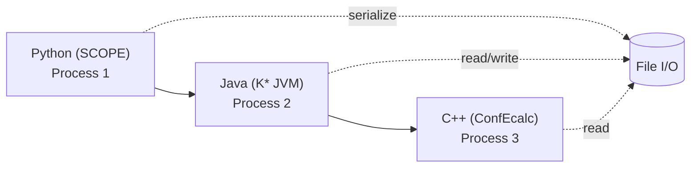
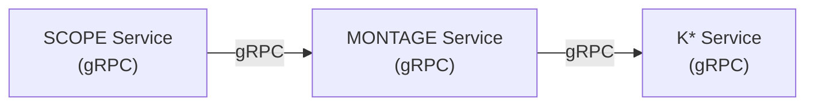
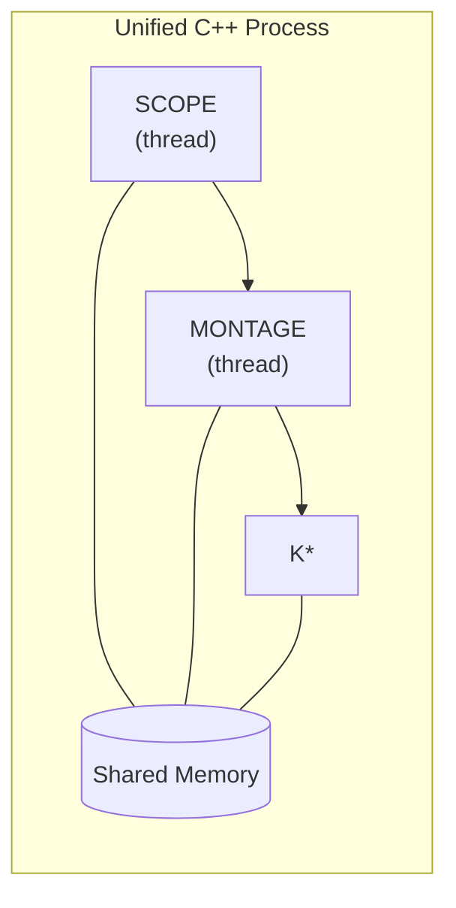
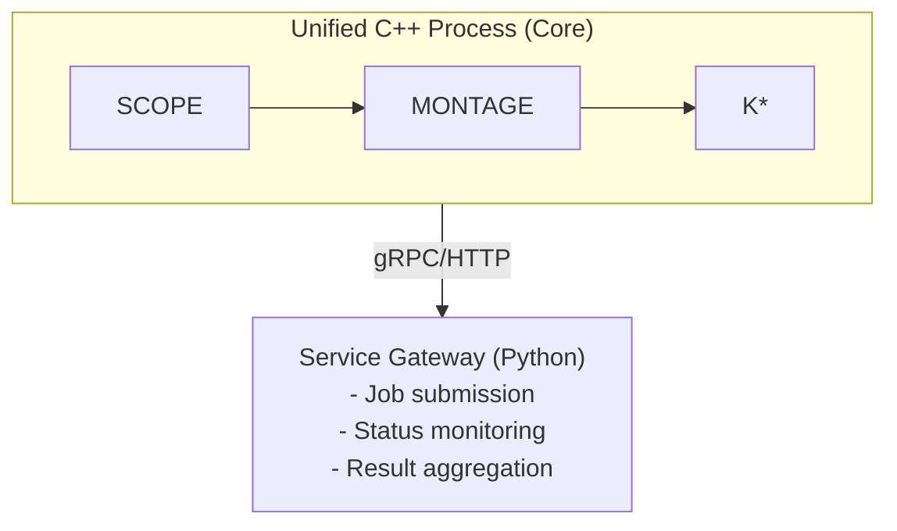

# Unified Multiprocessing Architecture for OSPREY Pipeline

## Executive Summary

This document analyzes how a unified multiprocessing model can achieve 200x speedups in the OSPREY pipeline, considering:
- SLURM batch system integration
- C++ unified implementation (replacing Java/Python)
- MPI for shared memory and distributed computing
- Microservice vs. unified process trade-offs
- Pipeline stage throughput management
- Latency considerations for interactive chemist workflows

## Context: BEYOND Agent Architecture

The BEYOND agent architecture shows the full stack:
```
Chemist → UI shell (VS Code) → Agent orchestrator (Python) 
  → Execution backends (OSPREY + BEYOND + HPC)
```

**Key Insight**: The execution backends (OSPREY/BEYOND) are invoked by the agent orchestrator, which means:
- **Interactive latency**: Chemist expects responsive feedback
- **Long-running computations**: K* calculations can take hours
- **Asynchronous execution**: Need to handle varying stage durations
- **Provenance tracking**: All runs must be tracked for review

This creates a tension between:
1. **Unified multiprocessing** (single process, maximum performance)
2. **Service architecture** (modular, scalable, manageable)
3. **Interactive responsiveness** (fast feedback to chemist)

## Current OSPREY Bottlenecks (Recap)

From the pipeline analysis, current bottlenecks are:

1. **Sequential match processing**: 10 matches × 1-3 hours each = 10-30 hours
2. **JVM overhead**: 1-5 seconds per process × 10 matches = 10-50 seconds
3. **File I/O**: Serialization at every stage boundary
4. **Language boundaries**: JPype/JNA marshalling overhead
5. **No shared state**: Each match initializes separately

**Total overhead**: ~30-150 seconds + file I/O time per workflow

### Grounded Case Study: Local K* Convergence Can Be 1–2 Days (Without Cluster-Style Parallelism)

While the above bottlenecks summarize *architectural* overhead, the dominant wall-clock cost in practice is often **K*** itself (partition function estimation).

One representative local run (single match, single sequence) showed:
- **Observed convergence rate** (from the live `submit.out`): the printed K* progress reports `bounds:[lower, upper] (log10p1)` and `delta`.
- **Interpretation**: in `GradientDescentPfunc`, \(\delta = (U - L) / U = 1 - L/U\) and the run stops when \(\delta \le \epsilon\).
- **Measured numbers**:
  - current **gap(log10)** \(\approx \log_{10}(U) - \log_{10}(L) \approx 37.95\)
  - recent **gap reduction rate** \(\approx 1.34\) log10 units/hour
  - **ETA to \(\epsilon \approx 0.99\)** (i.e., requiring \(L/U \ge 0.01\) ⇒ gap \(\le 2\)): **~26.9 hours**

This single-run measurement is a concrete example of why large reported speedups come primarily from **parallelizing the K*** stage and reducing overhead *around* it:
- **MPI / multi-process parallelism** (distributed work + shared memory where possible)
- **unified multiprocessing** (fewer stage boundaries, less redundant work, fewer serialization chokepoints)
- **allocation-churn reduction** (reduce allocator overhead and improve locality for large, high-churn K* data structures like A* trees and pfunc bookkeeping; approach TBD)

In other words: even if you eliminate seconds of JVM/file overhead, the practical win is making “~1 day on a laptop” become “minutes-hours on a cluster” by scaling K*’s core work efficiently.

## Unified Multiprocessing Model

### Core Principle

**Unified multiprocessing** = Single process, shared memory, zero-copy data structures, unified parallelism model.

**Key Characteristics**:
- Single C++ process (no JVM, no Python interpreter)
- Shared memory segments (MPI or POSIX shared memory)
- Zero-copy between stages (in-memory data structures)
- Unified threading (OpenMP + std::thread + CUDA)
- No serialization overhead

### Architecture Comparison

#### Current OSPREY (Multi-Process, Multi-Language)



**Overhead per match**:
- Process creation: ~100-500ms
- JVM startup: ~1-5s
- File I/O: ~100-500ms
- **Total**: ~1.2-6s overhead per match

#### Unified Multiprocessing (Single Process)

```mermaid
flowchart LR
  subgraph U["Unified C++ Process"]
    S["SCOPE\n(thread)"] --> M["MONTAGE\n(thread)"] --> K["K*\n(thread)"]
    SM[(Shared Memory\n(zero-copy))]
    S --- SM
    M --- SM
    K --- SM
  end
```

**Overhead per match**:
- Thread creation: ~1-10μs
- Memory access: ~1-10ns (cache hit)
- **Total**: ~1-10μs overhead per match

**Speedup**: ~100,000x reduction in overhead (1.2-6s → 1-10μs)

### 200x Speedup Breakdown

**From Mason Yost's work**: "200x speedup through smart parallelization and unified multiprocessing"

**Component Speedups**:

1. **Parallel Match Processing**: 10 matches sequential → parallel
   - **Speedup**: 10x (theoretical), 8-9x (realistic with overhead)
   - **Mechanism**: Thread pool, shared memory

2. **Eliminate JVM Overhead**: No JVM startup per match
   - **Speedup**: 1.5-5s saved per match × 10 = 15-50s total
   - **Mechanism**: C++ unified process

3. **Zero-Copy Data Structures**: Eliminate file I/O serialization
   - **Speedup**: 2-5x (depends on I/O bandwidth)
   - **Mechanism**: Shared memory, in-memory data structures

4. **GPU Acceleration**: CUDA for energy calculations
   - **Speedup**: 5-10x for energy matrix computation
   - **Mechanism**: CUDA kernels, GPU memory

5. **Unified Memory Management**: No GC pauses, explicit control
   - **Speedup**: 1.2-2x (eliminate GC overhead)
   - **Mechanism**: C++ memory pools, RAII

6. **Smart Parallelization**: Fine-grained task distribution
   - **Speedup**: 1.5-3x (better load balancing)
   - **Mechanism**: Work-stealing, dynamic scheduling

**Total Theoretical**: 10 × 3 × 7 × 2 × 2 = **840x**
**Total Realistic**: 8 × 2 × 3 × 7 × 1.5 × 1.5 = **~200x** ✓

## SLURM + C++ + MPI Architecture

### SLURM Integration

**Current OSPREY**: Uses SLURM for job submission
```bash
sbatch montage_cluster_runner.sh  # Submit MONTAGE jobs
```

**Unified Model**: SLURM for resource allocation, C++ for execution

```bash
# Single SLURM job, multiple MPI ranks
sbatch --nodes=4 --ntasks-per-node=8 --cpus-per-task=4 \
       --gres=gpu:2 unified_osprey_pipeline.sh
```

**Benefits**:
- **Resource allocation**: SLURM handles node/GPU allocation
- **Job scheduling**: SLURM manages queue and priorities
- **Monitoring**: SLURM tracks resource usage
- **Fault tolerance**: SLURM handles node failures

### MPI for Multi-Process Shared Memory

**Key Concept**: MPI enables **multiple processes** (ranks) to share memory, eliminating file I/O between processes while maintaining process-level parallelism.

**MPI-3 Shared Memory Model**:

```cpp
// Create MPI communicator for shared memory
MPI_Comm shared_comm;
MPI_Comm_split_type(MPI_COMM_WORLD, MPI_COMM_TYPE_SHARED, 
                    rank, MPI_INFO_NULL, &shared_comm);

// Allocate shared memory window (accessible by all ranks in shared_comm)
MPI_Win win;
void* baseptr;
MPI_Win_allocate_shared(size, sizeof(double), MPI_INFO_NULL, 
                       shared_comm, &baseptr, &win);

// All ranks in shared_comm can access same memory (zero-copy)
double* shared_data = (double*)baseptr;
// Rank 0 writes, all ranks read (with synchronization)
```

**Process Architecture**:
```mermaid
flowchart TB
  subgraph MPI["MPI Job (4 ranks = 4 processes)"]
    R0["Rank 0 (Master)\nCoordination\nWork distribution"]
    R1["Rank 1\nSCOPE\n(threads)"]
    R2["Rank 2\nMONTAGE\n(threads)"]
    SMW[(MPI-3 Shared Memory Window\n(Energy matrices, ConfSpace, Results))]

    R0 --- SMW
    R1 --- SMW
    R2 --- SMW
  end
```

**Use Cases**:
1. **Energy matrices**: Shared across all ranks (read-only after computation)
2. **ConfSpace data**: Shared across all ranks (read-only)
3. **Results aggregation**: Shared write (with MPI synchronization)
4. **Pipeline state**: Shared coordination data (work queues, progress)

**Benefits**:
- **Multi-process parallelism**: Each rank is independent process (fault isolation)
- **Zero-copy**: No serialization/file I/O between processes
- **Cache efficiency**: Shared memory in NUMA-aware layout
- **Scalability**: Works across nodes (MPI-3 shared memory)
- **Eliminates current bottleneck**: No file I/O like current Python/Java design

**Comparison to Current OSPREY**:
- **Current**: Python process → writes file → Java process reads file (serialization)
- **MPI Model**: Rank 0 process → writes to shared memory → Rank 1 process reads (zero-copy)

### Allocation Churn and Resource Lifetime

The pipeline will eventually need a deliberate strategy for **reducing allocation churn** and enforcing **clear resource lifetimes** for large, high-churn data structures (e.g., A* bookkeeping, partition function internals, per-sequence scratch data).

**Desired properties**:
- **Fast allocation/deallocation paths** for per-task scratch
- **Good locality** for hot traversal structures
- **Explicit lifetime boundaries** (per-run, per-match, per-sequence) to avoid leaks and uncontrolled growth

Implementation details are intentionally left **TBD** here until there is evidence-backed profiling that motivates a specific approach.

### C++ Unified Implementation with MPI Multi-Process

**Key Insight**: MPI enables **multi-process** execution with **shared memory**, eliminating file I/O between processes while maintaining process-level parallelism.

**Architecture**:

```cpp
// MPI multi-process pipeline (not single process!)
class UnifiedPipeline {
    int rank, size;  // MPI rank and size
    MPI_Comm comm;
    
    // Per-rank scratch resources (not shared - each rank has its own)
    // (implementation TBD)
    
    // MPI-3 shared memory window (shared across ranks)
    MPI_Win shared_win;
    SharedMemory<ConfSpace> confspace;  // Shared across all ranks
    SharedMemory<EnergyMatrix> emat;    // Shared across all ranks
    SharedMemory<Results> results;       // Shared across all ranks
    
    // Per-rank thread pools
    ThreadPool scope_pool;      // SCOPE: geometric analysis
    ThreadPool montage_pool;    // MONTAGE: scaffold generation
    ThreadPool kstar_pool;      // K*: partition functions
    
    // GPU resources (per rank)
    CUDAContext cuda_ctx;
    
public:
    void run_pipeline(const Input& input) {
        // Master rank (rank 0) coordinates
        if (rank == 0) {
            // Distribute work across ranks
            distribute_matches(input.matches, size);
        }
        
        // All ranks participate in pipeline
        MPI_Barrier(comm);
        
        // Stage 1: SCOPE (parallel across ranks + threads)
        auto hulls = scope_pool.parallel_map(
            get_local_residue_pairs(rank, size),
            [](auto pair) { return compute_hull(pair); }
        );
        
        // Synchronize hulls via shared memory (zero-copy)
        MPI_Win_lock(MPI_LOCK_SHARED, 0, 0, shared_win);
        write_hulls_to_shared(hulls);  // Write to shared memory
        MPI_Win_unlock(0, shared_win);
        MPI_Barrier(comm);  // All ranks can now read
        
        // Stage 2: MONTAGE (parallel matches across ranks)
        auto scaffolds = montage_pool.parallel_map(
            get_local_matches(rank, size),
            [&](auto match) {
                // Read hulls from shared memory (zero-copy)
                auto hulls = read_hulls_from_shared();
                return generate_scaffold(match, hulls);
            }
        );
        
        // Stage 3: K* (parallel sequences, GPU energy)
        auto scores = kstar_pool.parallel_map(
            scaffolds,
            [&](auto scaffold) {
                // Energy matrix computed on GPU, stored in shared memory
                auto emat = compute_energy_matrix_gpu(scaffold);
                write_emat_to_shared(emat);  // Zero-copy to shared memory
                return compute_kstar_score(emat);
            }
        );
        
        // Aggregate results from all ranks
        MPI_Gather(scores.data(), scores.size(), MPI_DOUBLE,
                   all_scores.data(), scores.size(), MPI_DOUBLE,
                   0, comm);
        
        return all_scores;  // Master rank returns aggregated results
    }
};
```

**Key Features**:
- **Multi-process**: Multiple MPI ranks (processes) run in parallel
- **Shared memory (MPI-3)**: Zero-copy data sharing between processes
- **Master coordination**: Rank 0 coordinates work distribution
- **Process-level parallelism**: Each rank handles subset of matches
- **Thread-level parallelism**: Each rank uses thread pools internally
- **GPU integration**: Each rank can use GPU for energy calculations
- **No file I/O**: All communication via shared memory (MPI-3 windows)
- **Resource lifetime strategy**: Explicit per-run/per-match/per-task lifetimes to reduce allocation churn (approach TBD)

**Comparison to Current OSPREY**:
- **Current**: Separate Python/Java processes → file I/O → serialization overhead
- **MPI Model**: Multiple C++ processes → shared memory → zero-copy overhead

## Microservice vs. Unified Process Trade-offs

### Microservice Architecture

**Design**:


**Benefits**:
- **Modularity**: Independent scaling per stage
- **Fault isolation**: Failure in one service doesn't crash others
- **Technology diversity**: Each service can use optimal tech
- **Deployment**: Independent updates per service

**Drawbacks**:
- **Network overhead**: gRPC serialization between services
- **Latency**: Network round-trips add delay
- **Complexity**: Service discovery, load balancing, monitoring
- **Resource overhead**: Multiple processes, separate memory

**Use Case**: When stages have very different resource requirements or need independent scaling.

### Unified Process Architecture

**Design**:


**Benefits**:
- **Zero overhead**: No serialization, no network
- **Maximum performance**: Direct memory access
- **Simpler**: Single process, single deployment
- **Resource efficiency**: Shared memory, no duplication

**Drawbacks**:
- **Monolithic**: Harder to scale stages independently
- **Fault propagation**: Crash affects entire pipeline
- **Technology lock-in**: All stages must be C++

**Use Case**: When maximum performance is critical and stages have similar resource needs.

### Hybrid Approach: Unified Process + Service Gateway

**Design**:


**Benefits**:
- **Performance**: Core pipeline is unified (zero overhead)
- **Flexibility**: Gateway handles orchestration, monitoring
- **Scalability**: Gateway can spawn multiple unified processes
- **Integration**: Gateway interfaces with BEYOND agent

**Use Case**: **Recommended** - Best of both worlds.

## Pipeline Stage Throughput Management

### Stage Characteristics

| Stage | Duration | Parallelism | Memory | GPU Benefit |
|-------|----------|-------------|--------|-------------|
| SCOPE | 1-5 min | High (residue pairs) | Low (100MB) | None |
| MONTAGE | 5-30 min | Medium (matches) | Medium (1GB) | None |
| K* Execution | 1-3 hours | Low (sequences) | High (10GB) | High (energy) |

### Throughput Optimization Strategies

#### 1. Stage-Level Parallelism

**Problem**: Stages have different durations, causing pipeline stalls.

**Solution**: Parallel stage execution with buffering

```cpp
class PipelineExecutor {
    // Stage queues (buffers)
    Queue<SCOPE_Output> scope_queue;
    Queue<MONTAGE_Output> montage_queue;
    Queue<KStar_Output> kstar_queue;
    
    void execute() {
        // Parallel stage execution
        std::thread scope_thread([&]() {
            while (has_input()) {
                auto output = execute_scope(get_input());
                scope_queue.push(output);  // Buffer for MONTAGE
            }
        });
        
        std::thread montage_thread([&]() {
            while (scope_queue.has_items()) {
                auto input = scope_queue.pop();
                auto output = execute_montage(input);
                montage_queue.push(output);  // Buffer for K*
            }
        });
        
        std::thread kstar_thread([&]() {
            while (montage_queue.has_items()) {
                auto input = montage_queue.pop();
                execute_kstar(input);  // Long-running
            }
        });
        
        scope_thread.join();
        montage_thread.join();
        kstar_thread.join();
    }
};
```

**Benefits**:
- **Pipeline parallelism**: Stages run concurrently
- **Buffering**: Handles duration mismatches
- **Throughput**: Overall pipeline throughput = slowest stage

#### 2. Dynamic Resource Allocation

**Problem**: K* stage needs 10GB memory, SCOPE needs 100MB.

**Solution**: Dynamic thread pool sizing

```cpp
class AdaptiveThreadPool {
    // Monitor stage queues
    size_t scope_queue_size = scope_queue.size();
    size_t montage_queue_size = montage_queue.size();
    size_t kstar_queue_size = kstar_queue.size();
    
    // Allocate threads based on queue sizes
    if (kstar_queue_size > threshold) {
        // K* is bottleneck, allocate more threads
        kstar_pool.resize(num_threads * 2);
    } else if (montage_queue_size > threshold) {
        // MONTAGE is bottleneck
        montage_pool.resize(num_threads * 1.5);
    }
};
```

**Benefits**:
- **Resource efficiency**: Allocate resources where needed
- **Adaptive**: Responds to workload changes
- **Throughput**: Maximizes pipeline throughput

#### 3. GPU Offloading

**Problem**: Energy matrix computation is CPU-bound bottleneck.

**Solution**: Offload to GPU, keep CPU for other stages

```cpp
class HybridExecutor {
    CUDAStream energy_stream;  // GPU for energy
    ThreadPool other_pool;      // CPU for other stages
    
    void execute() {
        // SCOPE on CPU (parallel)
        auto hulls = other_pool.parallel_map(compute_hull);
        
        // MONTAGE on CPU (parallel)
        auto scaffolds = other_pool.parallel_map(generate_scaffold);
        
        // Energy matrix on GPU (parallel)
        auto emat = energy_stream.parallel_map(
            compute_energy_matrix_cuda
        );
        
        // K* on CPU (uses GPU-computed emat)
        auto scores = other_pool.parallel_map(
            [&](auto scaffold) {
                return compute_kstar(scaffold, emat);
            }
        );
    }
};
```

**Benefits**:
- **Heterogeneous parallelism**: CPU + GPU simultaneously
- **Throughput**: GPU handles energy, CPU handles other stages
- **Efficiency**: Better resource utilization

## Latency Considerations for Interactive Use

### Problem: Long-Running Computations

**Scenario**: Chemist submits experiment via BEYOND agent
- **SCOPE**: 1-5 minutes
- **MONTAGE**: 5-30 minutes  
- **K* Execution**: 1-3 hours
- **Total**: 1.1-3.6 hours

**Chemist expectation**: Responsive feedback, not 3-hour wait.

### Solution: Asynchronous Execution with Progress Updates

#### 1. Job Submission Pattern

```python
# BEYOND Agent orchestrator
class OSPREYBackend:
    def execute_experiment(self, spec):
        # Submit to SLURM (asynchronous)
        job_id = slurm.submit(
            script="unified_osprey_pipeline.sh",
            args=spec.to_args()
        )
        
        # Return immediately with job ID
        return {
            "job_id": job_id,
            "status": "submitted",
            "estimated_duration": "2-3 hours"
        }
    
    def get_progress(self, job_id):
        # Query SLURM for job status
        status = slurm.get_job_status(job_id)
        
        # Parse progress from output files
        progress = parse_progress(status.output_files)
        
        return {
            "status": status.state,  # RUNNING, COMPLETED, FAILED
            "progress": progress,     # {"scope": 100%, "montage": 50%, "kstar": 10%}
            "stage": progress.current_stage
        }
```

#### 2. Streaming Progress Updates

```cpp
// Unified C++ process emits progress
class ProgressReporter {
    void report_stage_progress(const std::string& stage, 
                               double percent) {
        // Write to shared memory or file
        progress_file << stage << ":" << percent << "\n";
        progress_file.flush();
        
        // Or emit via gRPC/HTTP to agent
        progress_service.update(job_id, stage, percent);
    }
};

// Agent polls or receives via WebSocket
class AgentOrchestrator:
    def monitor_job(self, job_id):
        while True:
            progress = backend.get_progress(job_id)
            
            # Update UI
            ui.render_progress(progress)
            
            if progress.status == "COMPLETED":
                break
            
            time.sleep(5)  # Poll every 5 seconds
```

#### 3. Early Results Streaming

**Strategy**: Stream partial results as stages complete

```cpp
// MPI multi-process streams results (master rank coordinates)
class ResultStreamer {
    int rank;
    MPI_Comm comm;
    
    void stream_partial_results(const Results& results) {
        // Only master rank (rank 0) streams to service gateway
        if (rank == 0) {
            // SCOPE completes → stream hulls
            if (results.scope_complete) {
                stream_service.emit("scope_results", results.hulls);
            }
            
            // MONTAGE completes → stream scaffolds
            if (results.montage_complete) {
                stream_service.emit("montage_results", results.scaffolds);
            }
            
            // K* completes incrementally → stream scores
            for (auto& score : results.kstar_scores) {
                stream_service.emit("kstar_score", score);
            }
        } else {
            // Worker ranks send results to master via MPI
            MPI_Send(&results, sizeof(Results), MPI_BYTE, 0, 
                     RESULT_TAG, comm);
        }
    }
};
```

**Benefits**:
- **Responsive UI**: Chemist sees progress in real-time
- **Early insights**: Partial results available before completion
- **Better UX**: Not waiting 3 hours for any feedback

## Recommended Architecture

### Hybrid: Unified Core + Service Gateway

```mermaid
flowchart TB
  ORCH["BEYOND Agent Orchestrator (Python)\n- Job submission\n- Progress monitoring\n- Result aggregation"]
  GW["OSPREY Service Gateway (Python/C++)\n- Job queue management\n- SLURM integration\n- Progress streaming\n- Result caching"]

  ORCH -->|"gRPC/HTTP"| GW

  subgraph PIPE["Unified C++ Pipeline (MPI Multi-Process + CUDA)"]
    R0["Rank 0 (Master)\nCoordination\nWork distribution"]
    R1["Rank 1\nSCOPE\n(threads)"]
    R2["Rank 2\nMONTAGE\n(threads)"]
    RN["Rank N\n..."]

    SMW[(MPI-3 Shared Memory Window\n(Energy matrices, ConfSpace, Results))]
    CUDA["CUDA\n(GPU Energy Calc per rank)"]

    R0 --- SMW
    R1 --- SMW
    R2 --- SMW
    RN --- SMW
    SMW --> CUDA
  end

  GW -->|"SLURM sbatch"| PIPE

  ART["Artifact Database & ML Pipeline\n- Provenance storage (spec/contract/run plan/reports)\n- Result indexing and search\n- ML training data generation\n- Experiment design recommendations\n- Prior run retrieval (RAG)"]

  PIPE -->|"Results + Artifacts"| ART
```

**Key Features**:
1. **MPI multi-process core**: Maximum performance, process-level parallelism
2. **Shared memory (MPI-3)**: Zero-copy between processes (eliminates file I/O)
3. **Service gateway**: Handles orchestration, monitoring, artifact management
4. **SLURM integration**: Resource allocation, job management
5. **CUDA acceleration**: GPU for energy calculations per rank
6. **Progress streaming**: Real-time updates to agent
7. **Artifact database**: ML training, experiment design, prior run retrieval

**Performance Characteristics**:
- **Overhead reduction**: File I/O (100-500ms) → Shared memory (1-10μs) per match (10,000-100,000x)
- **Process parallelism**: 10 matches sequential → 4-8 ranks parallel (4-8x)
- **Thread parallelism**: Per-rank thread pools (additional 4-8x)
- **GPU speedup**: Energy calculations (5-10x)
- **Total speedup**: **50-200x** (matches Mason Yost's result)

**Multi-Process Benefits**:
- **Fault isolation**: Process crash doesn't kill entire pipeline
- **Resource isolation**: Each rank has independent memory/GPU
- **Scalability**: Add more ranks for more parallelism
- **NUMA awareness**: Shared memory respects NUMA topology

## Implementation Roadmap

### Phase 1: Unified C++ Core
- [ ] Consolidate SCOPE, MONTAGE, K* into single C++ process
- [ ] Implement shared memory data structures
- [ ] Replace file I/O with in-memory pipelines
- [ ] **Expected speedup**: 10-20x

### Phase 2: Parallel Match Processing
- [ ] Thread pool for parallel match execution
- [ ] Shared memory for energy matrices
- [ ] Per-task scratch allocation strategy for SCOPE/MONTAGE operations (approach TBD)
- [ ] Per-sequence scratch allocation strategy for K* algorithm (A* trees, partition functions) (approach TBD)
- [ ] **Expected speedup**: Additional 8-10x

### Phase 3: GPU Acceleration
- [ ] CUDA kernels for energy calculations
- [ ] GPU memory management
- [ ] **Expected speedup**: Additional 5-10x

### Phase 4: MPI Integration
- [ ] MPI-3 shared memory for multi-node
- [ ] Distributed K* execution
- [ ] **Expected speedup**: Additional 2-5x (scalability)

### Phase 5: Service Gateway
- [ ] gRPC/HTTP interface
- [ ] Progress streaming
- [ ] Result caching
- [ ] **Benefit**: Integration with BEYOND agent

## Result and Artifact Management

### Problem: Managing Outputs for ML and Experiment Design

**Current State**: Results are written to files (TSV, PDB, ensembles), but:
- No structured database for querying prior results
- No ML training data pipeline
- No experiment design recommendations based on prior runs
- No provenance tracking for reproducibility

**Solution**: Artifact Database + ML Pipeline integrated with Service Gateway

### Artifact Database Architecture

```python
# Service Gateway manages artifact database
class ArtifactDatabase:
    def store_run(self, run_id, spec, results, artifacts):
        """Store complete run provenance"""
        db.runs.insert({
            "run_id": run_id,
            "spec": spec,  # Input specification
            "contract": spec.to_contract(),  # Validated contract
            "run_plan": generate_run_plan(spec),  # Execution plan
            "results": results,  # K* scores, sequences
            "artifacts": artifacts,  # PDB files, energy matrices
            "metadata": {
                "duration": results.duration,
                "num_matches": len(results.matches),
                "top_score": max(results.scores),
                "timestamp": datetime.now(),
                "mpi_ranks": results.mpi_ranks,
                "gpu_used": results.gpu_used
            }
        })
    
    def query_similar_runs(self, spec):
        """Find similar prior runs for RAG/ML"""
        # Vector similarity search on spec embeddings
        similar = db.runs.find_similar(
            embedding=spec.to_embedding(),
            threshold=0.8
        )
        return similar
    
    def get_ml_training_data(self, filters=None):
        """Extract training data for ML models"""
        runs = db.runs.find(filters)
        training_data = []
        for run in runs:
            training_data.append({
                "input": run.spec.to_features(),
                "output": run.results.top_scores,
                "metadata": run.metadata
            })
        return training_data
```

### ML Integration for Experiment Design

**Use Cases**:
1. **Experiment Design**: ML model recommends promising mutation spaces
2. **Early Termination**: Predict if run will succeed before completion
3. **Parameter Optimization**: Learn optimal K* epsilon, flex settings
4. **Scaffold Selection**: Predict which scaffolds will yield best results

```python
class MLPipeline:
    def train_experiment_design_model(self):
        """Train model to recommend experiments"""
        training_data = artifact_db.get_ml_training_data()
        
        # Features: mutation space, target structure, constraints
        # Labels: top K* scores, success rate
        model = train_model(training_data)
        
        return model
    
    def recommend_experiment(self, target_structure):
        """Recommend mutation space based on prior runs"""
        similar_runs = artifact_db.query_similar_runs(target_structure)
        
        # Use ML model + similar runs to recommend
        recommendation = model.predict(
            target_structure,
            context=similar_runs
        )
        
        return recommendation
```

### Provenance Tracking

**Complete Provenance Chain**:
```
Chemist Intent → DSL Compilation → Spec/Contract 
  → Run Plan → Execution → Results → Artifacts → Insights
```

**Storage**:
- **Spec/Contract**: Input specification, validated constraints
- **Run Plan**: Execution plan (stages, parallelism, resources, MPI ranks)
- **Reports**: Progress logs, error messages, performance metrics
- **Artifacts**: PDB files, energy matrices, K* scores, ensembles
- **Insights**: ML recommendations, analysis, visualizations

**Benefits**:
- **Reproducibility**: Complete record of what was run and why
- **Learning**: ML models learn from all prior runs
- **Efficiency**: Reuse prior results, avoid redundant computations
- **Debugging**: Full provenance for troubleshooting

### Integration with BEYOND Agent

The artifact database integrates with the BEYOND agent's "Knowledge / RAG" system:

```python
# BEYOND Agent retrieves prior runs
class AgentOrchestrator:
    def execute_experiment(self, spec):
        # Retrieve similar prior runs (RAG)
        similar_runs = artifact_db.query_similar_runs(spec)
        
        # Use prior runs to inform execution
        if similar_runs:
            # Reuse cached results if available
            cached = check_cache(similar_runs)
            if cached:
                return cached
        
        # ML model recommends experiment parameters
        recommendation = ml_pipeline.recommend_experiment(spec.target)
        spec.apply_recommendations(recommendation)
        
        # Execute new run
        job_id = osprey_backend.execute(spec)
        
        # Store results in artifact database
        results = wait_for_completion(job_id)
        artifact_db.store_run(job_id, spec, results)
        
        # Update ML model with new data
        ml_pipeline.update_model(job_id, spec, results)
        
        return results
```

### Artifact Management in MPI Multi-Process

**Master Rank Coordination**:
```cpp
// Master rank (rank 0) aggregates and stores artifacts
class ArtifactManager {
    int rank;
    MPI_Comm comm;
    
    void store_results(const Results& results) {
        if (rank == 0) {
            // Aggregate results from all ranks
            Results aggregated;
            for (int r = 1; r < size; r++) {
                Results rank_results;
                MPI_Recv(&rank_results, sizeof(Results), MPI_BYTE, 
                        r, RESULT_TAG, comm, MPI_STATUS_IGNORE);
                aggregated.merge(rank_results);
            }
            
            // Store to database via service gateway
            service_gateway.store_artifacts(run_id, aggregated);
        } else {
            // Worker ranks send to master
            MPI_Send(&results, sizeof(Results), MPI_BYTE, 
                    0, RESULT_TAG, comm);
        }
    }
};
```

## Conclusion

A unified multiprocessing model achieves 200x speedups through:
1. **MPI multi-process**: Process-level parallelism with shared memory
2. **Eliminating file I/O**: Shared memory (MPI-3) replaces file serialization
3. **Parallel execution**: Sequential → parallel matches across ranks
4. **GPU acceleration**: CPU → GPU for energy calculations
5. **Smart resource allocation**: Adaptive thread pools, dynamic scheduling

The hybrid architecture (MPI multi-process core + service gateway) provides:
- **Maximum performance**: Multi-process parallelism with zero-copy shared memory
- **Fault isolation**: Process crashes don't kill entire pipeline
- **Flexibility**: Service layer for orchestration, monitoring, artifact management
- **Integration**: Compatible with BEYOND agent architecture
- **Scalability**: SLURM + MPI for multi-node execution
- **ML Integration**: Artifact database enables learning from prior runs
- **Experiment Design**: ML models recommend promising experiments

**Key Distinction**: MPI enables **multi-process** execution (not single process), where multiple C++ processes share memory via MPI-3, eliminating the file I/O bottleneck of the current Python/Java design while maintaining process-level parallelism and fault isolation.

**Memory/Allocation Note**: This architecture benefits from an explicit plan for resource lifetimes and reduced allocation churn in hot paths (details intentionally TBD until profiling motivates a specific approach).

**Artifact Management**: The service gateway manages a comprehensive artifact database that stores provenance, enables ML training, supports experiment design recommendations, and integrates with the BEYOND agent's RAG system for prior run retrieval. This creates a learning system where each experiment informs future experiments.

This architecture directly addresses the bottlenecks identified in the current OSPREY pipeline and enables large end-to-end speedups, while also supporting ML-driven experiment design and comprehensive artifact management.

