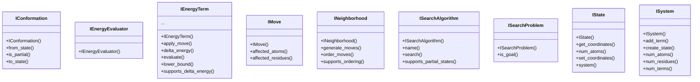

# Interface Class Hierarchy

Generated from regex parsing.

```mermaid
classDiagram

    class IConformation {
        +IConformation()
        +from_state()
        +is_partial()
        +to_state()
    }

    class IEnergyEvaluator {
        +IEnergyEvaluator()
    }

    class IEnergyTerm {
        +IEnergyTerm()
        +apply_move()
        +delta_energy()
        +evaluate()
        +lower_bound()
        +supports_delta_energy()
        ...
    }

    class IMove {
        +IMove()
        +affected_atoms()
        +affected_residues()
    }

    class INeighborhood {
        +INeighborhood()
        +generate_moves()
        +order_moves()
        +supports_ordering()
    }

    class ISearchAlgorithm {
        +ISearchAlgorithm()
        +name()
        +search()
        +supports_partial_states()
    }

    class ISearchProblem {
        +ISearchProblem()
        +is_goal()
    }

    class IState {
        +IState()
        +get_coordinates()
        +num_atoms()
        +set_coordinates()
        +system()
    }

    class ISystem {
        +ISystem()
        +add_term()
        +create_state()
        +num_atoms()
        +num_residues()
        +num_terms()
    }

```
