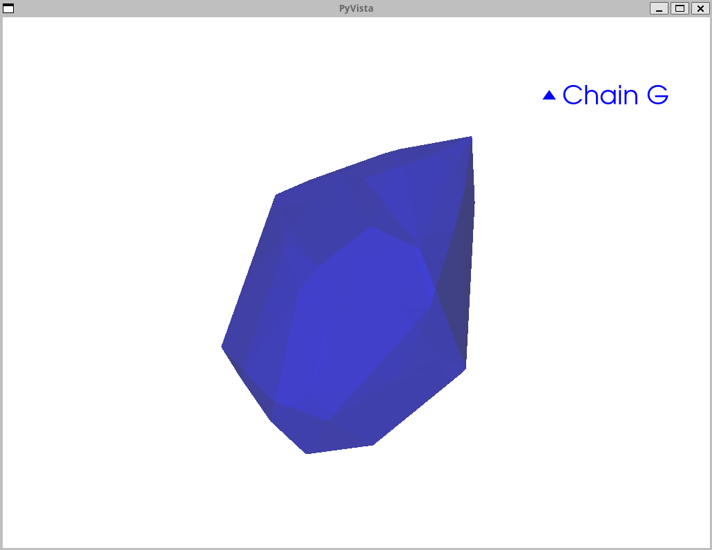
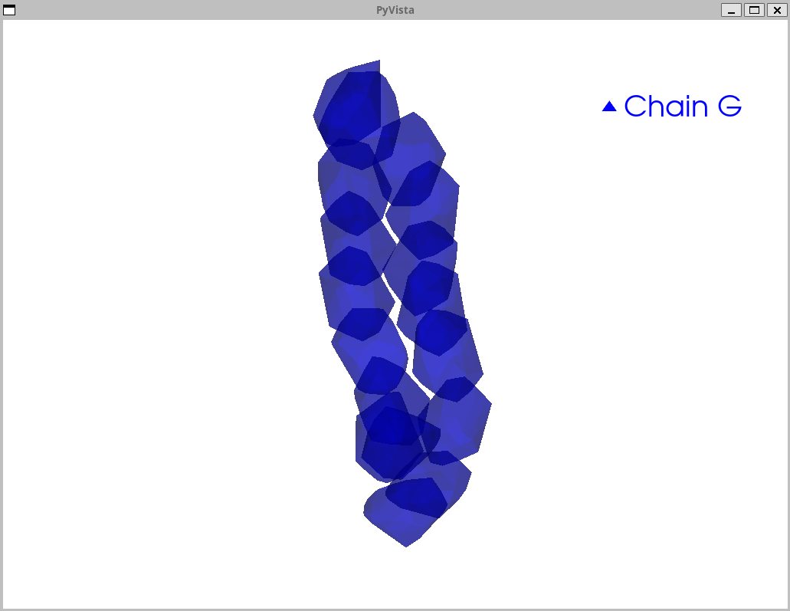
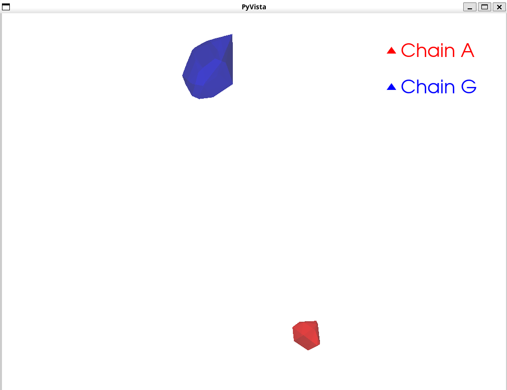
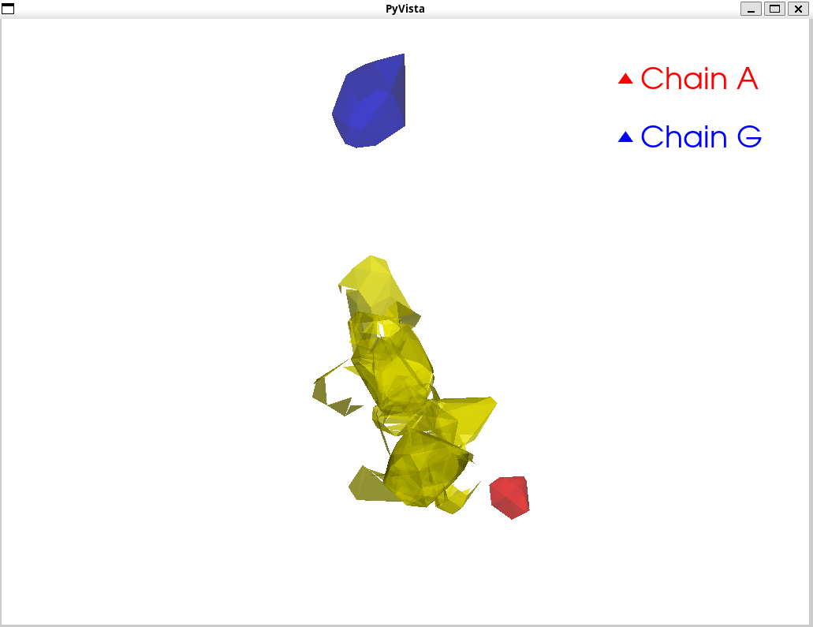
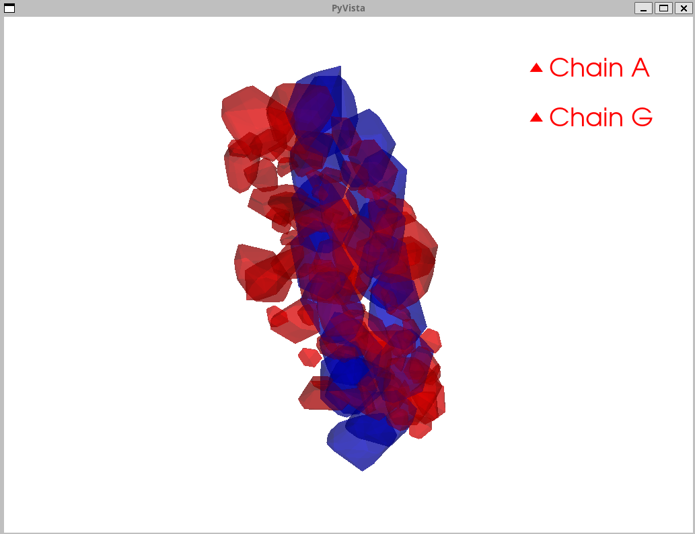

# SCOPE Convex Hull Visualization Analysis

## Overview

This document analyzes the visualization of SCOPE convex hulls using PyVista. The visualizations help understand what the "volume hull stuff" represents and how SCOPE identifies flexible residue pairs through geometric intersection analysis.

## What Are Convex Hulls in SCOPE?

**Convex hulls** represent the **3D volume that each residue can occupy** across all possible rotamer conformations. For each residue position:

1. **Generate rotamers**: Create all possible side-chain conformations (rotamers) for that residue
2. **Extract coordinates**: Get the 3D coordinates of all atoms in all rotamers
3. **Compute convex hull**: Find the smallest convex polyhedron that encloses all these points
4. **Result**: A 3D volume representing the "reachable space" for that residue

**Key insight**: If two residues' hulls intersect, they can potentially interact (form a "doublet"). If they don't intersect, they cannot interact regardless of rotamer choice.

## Test Case: 2RL0

- **Design Chain (G)**: 17 residues (638-654)
- **Target Chain (A)**: 89 residues (153-241)
- **Total hulls**: 106 (17 + 89)
- **Hull files**: `pdb_hulls_2rl0/`

## Visualization Results

### 1. Single Residue Hull (G638)



**What we see:**
- A simple, irregular polyhedron (blue)
- 47 points defining the hull
- Represents the conformational space for residue G638 across all 22 amino acid types

**Analysis:**
- The hull is relatively compact, indicating limited conformational flexibility
- The faceted surface shows the convex envelope of all rotamer positions
- This is the "building block" - each residue gets one hull per amino acid set

**Key insight**: Even a single residue's conformational space is a 3D volume, not just a point. This volume represents all possible positions the side-chain atoms can occupy.

### 2. Design Chain Hulls (Chain G - All 17 Residues)



**What we see:**
- 17 blue polyhedra (one per design chain residue)
- Hulls are arranged in a chain-like structure
- Some hulls overlap, some are separate

**Analysis:**
- **Overlapping hulls**: Residues that can interact (intra-chain doublets)
- **Separate hulls**: Residues that cannot interact regardless of rotamer choice
- The chain structure is visible - residues are spatially arranged along the protein backbone

**Key insight**: SCOPE identifies which design chain residues can form doublets by detecting hull overlaps. The 17 intra-chain pairs found correspond to these overlapping regions.

### 3. Representative View (One Hull Per Chain)



**What we see:**
- One red hull (Chain A - target chain, representative residue)
- One blue hull (Chain G - design chain, representative residue)
- They are spatially separated

**Analysis:**
- This view shows the general spatial relationship between chains
- The separation suggests these particular residues don't interact
- However, other residue pairs may have overlapping hulls (as seen in intersection view)

**Key insight**: Not all residue pairs interact. SCOPE's job is to find which ones do through systematic intersection testing.

### 4. Intersection View (Overlapping Hulls)



**What we see:**
- Red hulls (Chain A - target chain)
- Blue hulls (Chain G - design chain)
- **Yellow regions**: Intersections between design and target chain hulls
- 10 intersections shown (limited for clarity)

**Analysis:**
- **Yellow intersections = Inter-chain contacts**: These are the residues that can interact between design and target chains
- The intersections show the **volume of overlap** - larger intersections mean more potential interaction space
- These correspond to the inter-chain pairs identified by SCOPE

**Key insight**: The yellow regions are what SCOPE's `find_volume_overlap()` function calculates. The volume of these intersections determines which residues are considered "flexible" and can form contacts.

### 5. All Hulls View (Complete System)



**What we see:**
- Dense cluster of 106 hulls
- Red hulls (Chain A - 89 residues)
- Blue hulls (Chain G - 17 residues)
- Extensive overlapping regions (purple where red and blue overlap)

**Analysis:**
- **Density**: The target chain (A) has many more residues, creating a dense cluster
- **Overlap complexity**: Many hulls overlap, showing the complexity of potential interactions
- **Spatial organization**: The structure shows the protein's 3D shape - residues cluster in space

**Key insight**: This view shows why SCOPE's intersection detection is computationally expensive - there are many potential pairs to test (17 × 89 = 1,513 inter-chain pairs, plus 17 × 16 / 2 = 136 intra-chain pairs).

## Computational Implications

### Why Volume Overlap Calculation is Expensive

From the profiling analysis, we know:
- **79.6% of time** spent in volume overlap calculation
- **268M calls** to `v_dot` (vector dot product)
- **40M calls** to `inside_all` (point-in-hull testing)

**Visual explanation:**
1. For each pair of hulls, SCOPE must:
   - Test if they intersect (quick boolean check)
   - If intersecting, calculate the **exact volume** of overlap (expensive)
2. The volume calculation requires:
   - Testing thousands of points to see if they're inside both hulls
   - Each point test requires dot products with all hull faces
   - For 106 hulls, this means testing many pairs

**The visualization shows why**: The dense overlapping regions mean many pairs need detailed volume calculations.

### Hull Complexity

**Point counts per hull:**
- Chain A residues: 10-40 points per hull (varies by residue type)
- Chain G residues: 47 points per hull (consistent - all use same 22 amino acid set)

**Why this matters:**
- More points = more complex hull geometry
- More complex hulls = more expensive intersection calculations
- Chain G hulls are more complex because they include all 22 amino acid types

## Insights from Visualization

### 1. Spatial Clustering

The "show all" view reveals that residues cluster in 3D space, which explains:
- Why some residues have many interactions (dense clusters)
- Why some residues have no interactions (isolated regions)
- The importance of spatial indexing for optimization

### 2. Intersection Patterns

The intersection view shows:
- **Not all residues interact**: Only specific pairs have overlapping hulls
- **Intersection volumes vary**: Some overlaps are large (strong potential interactions), some are small
- **Spatial distribution**: Interactions are not random - they follow the protein's structure

### 3. Computational Bottlenecks

The visualization confirms profiling findings:
- **Many pairs to test**: 106 hulls = many potential pairs
- **Complex intersections**: Overlapping hulls require expensive volume calculations
- **No early pruning**: SCOPE tests all pairs, even those that clearly don't intersect

## Optimization Opportunities (Reinforced by Visualization)

### 1. Spatial Indexing

**Observation**: Many hulls are spatially separated and cannot intersect

**Optimization**: Use bounding boxes to quickly eliminate non-overlapping pairs before expensive volume calculations

**Expected speedup**: 5-10x (matches profiling analysis)

### 2. Parallel Processing

**Observation**: Hull pairs are independent - can test multiple pairs simultaneously

**Optimization**: Parallelize intersection detection across pairs

**Expected speedup**: 2-4x on 4-core CPU

### 3. Caching

**Observation**: Same hulls are tested multiple times (e.g., Chain G hulls tested against many Chain A hulls)

**Optimization**: Cache hull geometries and intersection results

**Expected speedup**: 2-5x

### 4. Vectorization

**Observation**: Point-in-hull testing (268M `v_dot` calls) is the hottest function

**Optimization**: Vectorize `v_dot` with NumPy to process thousands of points at once

**Expected speedup**: 10-100x for point testing

## Conclusion

The PyVista visualizations provide crucial insights into SCOPE's computational behavior:

1. **What hulls represent**: 3D volumes of conformational space, not just points
2. **Why intersections matter**: They identify which residues can interact
3. **Why it's expensive**: Many pairs, complex geometry, expensive volume calculations
4. **How to optimize**: Spatial indexing, parallelization, caching, vectorization

The visualizations confirm and reinforce the profiling findings, showing that:
- Volume overlap calculation is the dominant bottleneck (79.6% of time)
- Vector dot product is the hottest function (268M calls, 17.4% of time)
- Spatial optimization opportunities exist (many non-overlapping pairs)

**Next steps:**
1. Implement vectorization of `v_dot` (biggest win, easiest to implement)
2. Add spatial indexing for early pruning (5-10x speedup)
3. Parallelize intersection detection (2-4x speedup)
4. Re-visualize after optimizations to verify improvements

## Files Generated

- `../../scripts/plots/visualize_scope_hulls/pdb_hulls_2rl0.png` - Representative view
- `../../scripts/plots/visualize_scope_hulls/pdb_hulls_2rl0_chain_G.png` - Design chain only
- `../../scripts/plots/visualize_scope_hulls/pdb_hulls_2rl0_chain_G_residue_638.png` - Single residue
- `../../scripts/plots/visualize_scope_hulls/pdb_hulls_2rl0_chain_G_show-intersections.png` - Intersections
- `../../scripts/plots/visualize_scope_hulls/pdb_hulls_2rl0_chain_G_show-all.png` - All hulls

## Visualization Script

The visualization script is available at:
- `scripts/visualize_scope_hulls.py`

**Usage:**
```bash
# Representative view
python3 scripts/visualize_scope_hulls.py --hull-folder pdb_hulls_2rl0

# Specific chain
python3 scripts/visualize_scope_hulls.py --hull-folder pdb_hulls_2rl0 --chain G

# Specific residue
python3 scripts/visualize_scope_hulls.py --hull-folder pdb_hulls_2rl0 --chain G --residue 638

# Show intersections
python3 scripts/visualize_scope_hulls.py --hull-folder pdb_hulls_2rl0 --show-intersections

# Show all hulls
python3 scripts/visualize_scope_hulls.py --hull-folder pdb_hulls_2rl0 --show-all
```

