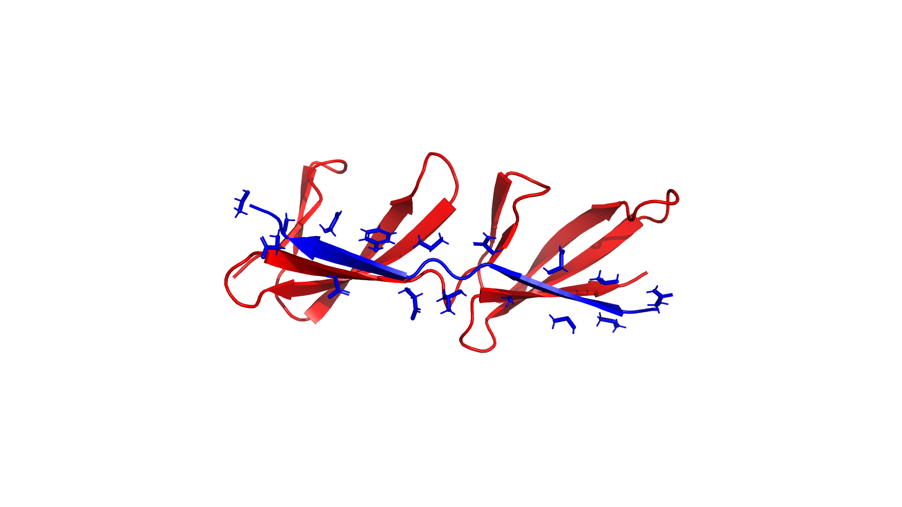

# PyMOL Visualization Analysis

## Overview

PyMOL visualizations of OSPREY structures provide high-quality molecular graphics for understanding protein-ligand complexes, design chains, and conformational spaces.

## Structure Visualization: 2RL0



### What This Visualization Shows

**Structure**: 2RL0 protein-ligand complex

**Color coding**:
- **Blue (Chain G)**: Design chain - residues that can be mutated
- **Red (Chain A)**: Target chain (ligand) - binding partner
- **Sticks**: Side-chain atoms of design chain (shows current rotamer conformations)

### Relevance to OSPREY Pipeline

1. **Design Chain Identification**:
   - Chain G (blue) contains 17 designable residues (638-654)
   - These are the positions where mutations will be tested
   - Side-chains shown represent current wild-type conformations

2. **Binding Interface**:
   - Spatial relationship between design chain (G) and target chain (A)
   - Proximity indicates potential interaction sites
   - Residues close to the interface are more likely to affect binding

3. **SCOPE Context**:
   - This structure is the input to SCOPE convex hull analysis
   - SCOPE identifies which design chain residues can interact with target chain
   - The visualization shows the physical basis for SCOPE's geometric analysis

4. **K* Algorithm Context**:
   - K* evaluates sequences by calculating binding affinities
   - This structure represents the starting point for sequence optimization
   - Mutations in Chain G will be evaluated for their effect on binding to Chain A

### Key Features Visible

- **Protein backbone**: Cartoon representation shows secondary structure
- **Side-chain flexibility**: Sticks show current rotamer positions
- **Spatial arrangement**: 3D structure reveals binding geometry
- **Chain separation**: Clear distinction between design and target chains

### Usage in Analysis

This visualization helps:
- Understand the physical structure being analyzed
- Identify interface regions for focused analysis
- Validate SCOPE results (check if identified interactions make structural sense)
- Communicate results to collaborators

## Generating Visualizations

### Basic Structure

```bash
python3 scripts/visualize_with_pymol.py \
    --pdb examples/python.KStar/2RL0.min.reduce.pdb \
    --design-chain G \
    --target-chain A \
    --output 2RL0_structure.png
```

### With Convex Hulls

```bash
python3 scripts/visualize_with_pymol.py \
    --pdb examples/python.KStar/2RL0.min.reduce.pdb \
    --design-chain G \
    --target-chain A \
    --show-hulls \
    --hull-folder pdb_hulls_2rl0 \
    --output 2RL0_with_hulls.png
```

### Interactive Mode

```bash
python3 scripts/visualize_with_pymol.py \
    --pdb examples/python.KStar/2RL0.min.reduce.pdb \
    --design-chain G \
    --target-chain A \
    --interactive
```

## Output Organization

All PyMOL visualizations are saved to:
- `pipeline_analysis/scope/pymol_visualizations/`

**Current files**:
- `2RL0_structure.png` - 2RL0 structure visualization (design chain G in blue, target chain A in red)

**Naming convention** (for future outputs):
- `{pdb_name}_structure.png` - Basic structure visualization
- `{pdb_name}_with_hulls.png` - Structure with convex hulls
- `{pdb_name}_interface.png` - Interface-focused view
- `{pdb_name}_mutations.png` - Highlighted mutation sites

## Integration with Pipeline Analysis

### Stage 1: SCOPE
- Visualize structure to understand geometric context
- Overlay convex hulls to see conformational spaces
- Identify which residues SCOPE identified as interacting

### Stage 2: MONTAGE
- Visualize scaffold structures
- Compare scaffold geometries
- Validate structural compatibility

### Stage 3: Energy Matrix
- Visualize energy landscapes (if mapped to structure)
- Identify high-energy regions

### Stage 4: K* Results
- Visualize top-ranked sequences
- Show mutation sites
- Compare wild-type vs. designed structures

### Stage 5: ARISE
- Visualize iterative design progression
- Show sequence evolution
- Final designed structures

## Technical Details

**Resolution**: 1920×1080 pixels, 300 DPI
**Ray-tracing**: Enabled for high-quality shadows and lighting
**Format**: PNG (raster, suitable for presentations/publications)

**PyMOL version**: pymol-open-source 3.2.0a0
**Installation**: `uv pip install pymol-open-source`

## Comparison with PyVista

**PyVista** (used for hull visualization):
- Better for geometric shapes (convex hulls)
- Faster for many objects
- Good for programmatic visualization

**PyMOL** (used for structure visualization):
- Better for molecular structures
- Publication-quality rendering
- Industry standard
- Better for detailed molecular graphics

**Use both**: PyVista for hulls, PyMOL for structures

