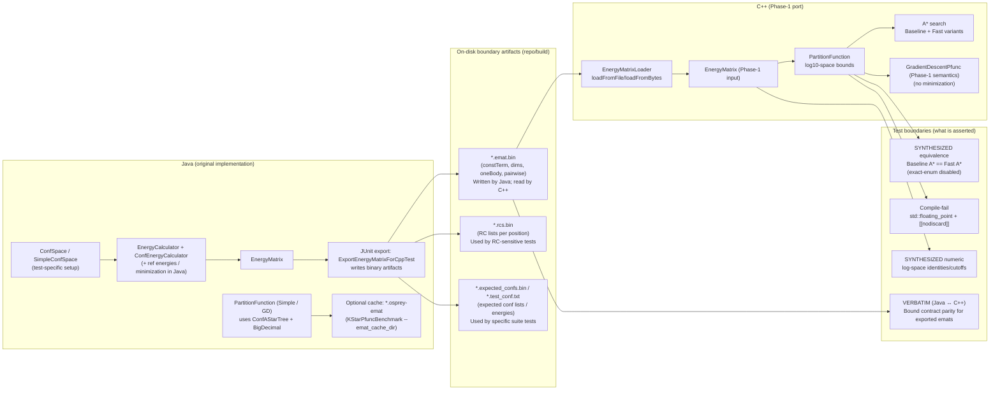

# C++ K* Phase-1: Correctness + C++20 Rationale (Code/Tests Index)

This document is the canonical “why it is correct” index for the Phase-1 C++ K* partition-function port.
It ties **behavioral contracts** to **implementation files** and to the **tests that demonstrate the behavior**.

Scope: Phase-1 is **EnergyMatrix-only** (no continuous minimization, no ConfSpace/JNA pipeline).

## Test categories (what each category proves)

This repo uses multiple test categories because no single class of tests can prove:
- Java parity (verbatim contracts),
- algorithmic equivalence between refactors (baseline vs fast),
- numeric safety properties (log-space arithmetic),
- compile-time safety invariants (C++20 concepts, `[[nodiscard]]`).

### Category A: VERBATIM contract tests (Java ↔ C++)
Proves that the C++ port satisfies the same **observable contract** as OSPREY Java for selected cases:
- `Q*` meets the same bound for the same epsilon.

### Category B: SYNTHESIZED guardrails (algorithmic equivalence)
Proves refactors do not change semantics:
- A* baseline vs fast equivalence at the algorithm and partition-function layers.

### Category C: SYNTHESIZED numeric unit tests (log-space arithmetic)
Proves the numeric machinery used in Phase-1 is stable and behaves as intended:
- `log10Add`, `log10Sub` identities and dominance cutoffs.

### Category D: Compile-fail tests (C++20 safety contracts)
Proves compile-time invariants are enforced:
- `std::floating_point` rejects invalid template instantiations.
- `[[nodiscard]]` is not ignored (compiled with `-Werror=unused-result` in the compile-fail harness).

## Behavioral contract (PartitionFunction)

### Inputs/Outputs
- **API**: `osprey::kstar::PartitionFunction<T>`
  - `compute(const EnergyMatrix<T>& emat, T epsilon, PartitionFunctionMethod method, ComputeOptions options)`
  - Source: `src/main/cpp/kstar/partition_function.hpp`
- **Result**: `PartitionFunctionResult<T>`
  - `lower_bound`, `upper_bound`: **log10(Q)** bounds
  - `delta`: \((U - L) / U\)
  - `converged`: `delta <= epsilon`

### Numeric representation
- **C++ Phase-1** uses **log10-space arithmetic** to avoid overflow/underflow:
  - `log10BoltzmannWeight`, `log10Add`, `log10Sub`
  - Source: `src/main/cpp/kstar/partition_function.cpp`
- **OSPREY Java** uses `BigDecimal` accumulation. Phase-1 equivalence is asserted via the same *bound* contract (see tests).

### Exact enumeration shortcut (correctness/bench hygiene)
- The implementation optionally uses exhaustive enumeration for small spaces:
  - Guarded by `ComputeOptions::allow_exact_enumeration`
  - Source: `src/main/cpp/kstar/partition_function.cpp`
- Benchmarks and A* variant equivalence tests disable this to ensure they actually exercise A*.

## A* search (Baseline vs Fast)

### Contract
`AStarVariant::Baseline` and `AStarVariant::Fast` must be **behaviorally identical** for partition-function math:
- Same evaluated leaf set for a given emat
- Same computed energies per leaf
- Same `lower_bound`, `upper_bound`, `delta`, `converged`, `num_confs` (within tight tolerances)

### Implementation files
- **Baseline**:
  - Node: `src/main/cpp/kstar/astar_node.hpp`
  - Search: `src/main/cpp/kstar/astar_search.hpp`, `src/main/cpp/kstar/astar_search.cpp`
- **Fast**:
  - Node: `src/main/cpp/kstar/astar_node_fast.hpp`
  - Search: `src/main/cpp/kstar/astar_search_fast.hpp`, `src/main/cpp/kstar/astar_search_fast.cpp`
- Variant selection is wired in:
  - `PartitionFunction<T>::ComputeOptions::astar_variant`
  - Source: `src/main/cpp/kstar/partition_function.hpp` + `src/main/cpp/kstar/partition_function.cpp`

### Tests that demonstrate equivalence
- **Structural A*** equivalence on a tiny, synthetic `EnergyMatrix`:
  - `src/test/cpp/kstar/test_astar_search.cpp`
- **Partition-function A* variant equivalence** (Baseline vs Fast), with exact-enum disabled:
  - `src/test/cpp/kstar/test_partition_function_gtest.cpp`
  - See `PartitionFunction_AStarVariants.*` tests.

## GradientDescentPfunc (Phase-1 semantics)

### Contract (ported structure)
- Preserves OSPREY’s “score-reader reads ahead; energy-reader consumes buffered confs” semantics via a `std::deque` buffer.
- Preserves the bound math structure; Phase-1 difference: **no minimization**, so score/energy are both derived from `EnergyMatrix`.

### Implementation
- `PartitionFunction<T>::computeWithGradientDescent`
  - Source: `src/main/cpp/kstar/partition_function.cpp`

### Tests
- Verbatim-style bound checks:
  - `src/test/cpp/kstar/test_partition_function_gtest.cpp`
  - See `PartitionFunction_VERBATIM.*GD*Cpu*` tests.

## Verbatim contract tests (Java ↔ C++)

These tests assert the *same correctness contract* as OSPREY’s Java tests: the reported \(Q^*\) must meet the same bound threshold for the same epsilon.

- C++ tests:
  - `src/test/cpp/kstar/test_partition_function_gtest.cpp`
- EnergyMatrix input comes from Java export:
  - See helper/export test(s) under `src/test/java/edu/duke/cs/osprey/kstar/`

Important caveat: Phase-1 is emat-only; Java “end-to-end” includes additional pipeline work unless specifically isolated/cached.

## Java ↔ C++ boundary (Phase-1 integration + test contracts)

Phase-1 draws a hard line at **EnergyMatrix artifacts**. Java produces them; C++ consumes them.
Tests are structured so the cross-language boundary is a *file format* + a *small set of invariants*.

**Boundary contracts (what must match across Java/C++):**
- **`*.emat.bin` format**: written by `ExportEnergyMatrixForCppTest` (Java), parsed by `EnergyMatrixLoader<T>` (C++).
- **Verbatim correctness**: for the same exported matrix + epsilon, C++ must satisfy the same *bound* contract the Java tests assert (not “same wall-clock pipeline cost”).

**Not part of Phase-1 (intentionally out of scope for C++ parity today):**
- Continuous minimization and the full Java energy/ref-energy pipeline during pfunc compute (Java bench runs this unless isolated).

## C++20 usage (what is used and why)

### `std::floating_point` (C++20 concepts)
- Used to constrain all numeric templates to float/double-like types.
- Benefit: prevents accidental instantiation with integral or custom types that would silently break numeric assumptions.
- Where:
  - `src/main/cpp/kstar/partition_function.hpp`
  - `src/main/cpp/kstar/energy_matrix.hpp` and other numeric templates

### `[[nodiscard]]`
- Used on expensive compute APIs to prevent accidental “fire and forget”.
- Benefit: correctness guardrail (ignored results are a real failure mode in large refactors).
- Where:
  - `src/main/cpp/kstar/partition_function.hpp`

### `std::optional` (primarily in tests)
- Used for “test data present?” flows without sentinel values.
- Benefit: cleaner correctness tests; less brittle than exception-only control flow.
- Where:
  - `src/test/cpp/kstar/test_partition_function_gtest.cpp` (emat load/skip helpers)

## How to run the relevant tests

Assuming you configured/build the CMake tree for `src/main/cpp/kstar/`:

- A* correctness and equivalence:
  - `ctest --output-on-failure -R astar`
- Partition function correctness + verbatim checks:
  - `ctest --output-on-failure -R partition_function`

- Log-space numeric unit tests:
  - `ctest --output-on-failure -R log_space`

- Compile-fail safety tests (C++20 constraints + `[[nodiscard]]`):
  - `ctest --output-on-failure -R compile_fail`

Notes:
- Some tests `GTEST_SKIP()` if the Java-exported emat binaries are not present under `src/test_data/` (expected).

## Tooling that strengthens these correctness claims (non-fuzz)

This repo’s current correctness story is primarily: **verbatim Java parity + synthesized equivalence + numeric unit tests + compile-fail contracts**. The following tools reinforce that story without depending on more VERBATIM ports.

- **Bounded model checking (CBMC)**: exhaustively explore bounded behaviors for small pure functions (good fit for log-space helpers and small invariants).
- **Property-based testing**: generate randomized numeric cases and assert invariants (monotonicity, NaN/inf handling, dominance thresholds).
- **Differential testing**: compare two implementations/precisions (baseline vs fast, float vs double, C++ vs Java expectations where defined).
- **Static analysis**: `clang-tidy`, clang static analyzer, `cppcheck` for bug patterns that tests don’t reliably trigger.
- **Sanitizers**: ASan/UBSan/TSan/MSan to turn “silent UB” into crashes during test runs.
- **Symbolic execution (KLEE)**: generate concrete inputs that force execution through hard-to-reach branches in small, well-scoped harnesses.

## Precision testing roadmap (prioritized tiers)

Detailed notes and run commands live in:

- `src/main/cpp/kstar/PRECISION_TESTING.md`

- **Tier 0 (implement first): Differential + metamorphic GTests**
  - Baseline vs Fast A* equivalence over many small synthetic matrices (reproducible RNG).
  - A* bounds contain the exact-enumeration result on tiny spaces (exact enum used as an oracle).
  - Float vs double sanity checks on the same matrices (tolerance-based).

- **Tier 1: Expand metamorphic/property-style coverage**
  - Systematic edge-case generation for numeric invariants (log-space cutoffs, NaN/inf handling, monotonicity).
  - Broader `ComputeOptions` coverage (epsilon extremes, determinism, convergence behavior).

- **Tier 2: CBMC on the smallest surfaces**
  - Bounded proofs for `log_space.hpp` invariants with restricted domains.

- **Tier 3 (deprioritized for now): KLEE**
  - Use only after coverage plateaus and specific hard-to-reach branches are identified.