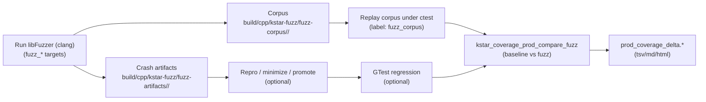

# Coverage-Guided Test Generation for the C++ K* Port

This doc complements `CODE_COVERAGE.md`. It focuses on **how to use coverage results to drive new tests/inputs** that exercise *uncovered* code paths.

## Key idea: lcov is a *measurement*, not usually the *feedback loop*

Tools that target uncovered paths typically work in one of these ways:

- **Coverage-guided fuzzing**: repeatedly mutates inputs and keeps the ones that increase edge coverage.
- **Symbolic / concolic execution**: solves path constraints to force execution down unexplored branches.
- **Search-based generation**: attempts to synthesize test sequences to satisfy coverage objectives (stronger in Java; weaker in C++).

In practice:

- Use **`lcov`/HTML reports** to decide *where* missing coverage.
- Use **fuzzing / symbolic execution** to produce inputs that hit those regions.
- Promote high-value inputs into **regression tests** (GTest) and re-run `kstar_coverage_prod`.

## Non-fuzz tools that help with coverage + correctness

These complement libFuzzer. Most relevant for **numeric/correctness contracts** (see `log_space.hpp` and `CORRECTNESS_AND_CXX20_RATIONALE.md`) where failures can be subtle and branch coverage may plateau without more structured input synthesis.

- **CBMC (bounded model checking)**:
  - Exhaustively explores program behaviors up to a bound (loop unwind, array sizes).
  - Strong for **small, pure, side-effect-light** logic (examples: `log10Add`, `log10Sub`, bounds math helpers).
  - Typically requires carefully-scoped harnesses and avoids large STL-heavy surfaces.

- **Property-based testing (QuickCheck-style)**:
  - Generates many randomized cases and checks invariants; good for numeric identities and edge cases.
  - For log-space arithmetic, target invariants like:
    - monotonicity (`log10Add(a,b) >= max(a,b)` when finite),
    - neutral element behavior (neg-inf as 0),
    - NaN propagation rules,
    - “dominance cutoff” behavior (the ±36 thresholds).
  - Libraries: RapidCheck / Catch2 generators (if adopted).

- **Differential/metamorphic testing**:
  - Compare two implementations or two precisions on the same generated inputs.
  - Relevant comparisons already present in this repo’s test strategy:
    - baseline vs fast A* variants,
    - C++ vs Java parity (verbatim contracts),
    - double vs float (where applicable) with tolerance-based assertions.

- **Mutation testing (Mull)**:
  - Mutates the compiled code and checks whether tests fail; measures “test sensitivity”, not coverage.
  - Useful once the correctness tests exist (guards against false confidence from high line coverage).

- **KLEE (symbolic execution)**:
  - Generates concrete inputs by solving path constraints (best for “hard-to-reach” branches).
  - Works on **LLVM bitcode**; practical when the target/harness is small and avoids heavy OS/STL interactions.

- **Sanitizers (ASan/UBSan/TSan/MSan)**:
  - Not a generator, but critical for correctness hardening and finding undefined behavior.
  - Particularly relevant for numeric code (UBSan) and parsers/loaders (ASan/UBSan).

- **Static analysis (clang-tidy / clang static analyzer / cppcheck)**:
  - Finds defect patterns without executing code (misuse of `[[nodiscard]]`, narrowing, lifetime issues, suspicious comparisons).
  - Complements runtime testing, especially in template-heavy headers.

## Starting point: fuzzing with libFuzzer

### Works best

- Parsing/decoding, input validation, boundary conditions, “many small branches”.
- Deterministic code with minimal global state.

### Why

- It optimizes for “new coverage” by design (no need to feed it `lcov`).
- It finds crashers, sanitizer issues, and weird corner cases quickly.

### Need to add (high level)

- A **fuzz harness** that calls into a “target” API with a byte buffer.
- A **seed corpus** of a few valid-ish inputs (even tiny ones).
- Build with Clang + sanitizers + libFuzzer flags.

Initial targets in this repo (based on current C++ surface area):

- `energy_matrix_loader.cpp`: fuzz input formats / parsing / error handling.
- `astar_search.cpp`: fuzz small synthetic matrices + search parameters.
- `partition_function.cpp`: fuzz small conf spaces / edge parameters.
- `conf_search_astar.cpp`: fuzz ConfSearch over tiny synthetic matrices + ordering/pruning edge cases.

### Repo support: EnergyMatrixLoader fuzz target

This repo includes a first libFuzzer target:

- **Target**: `fuzz_energy_matrix_loader`
- **Convenience runner**: `kstar_fuzz_energy_matrix_loader`

It fuzzes the Java-exported binary EnergyMatrix format by calling:

- `EnergyMatrixLoader<double>::loadFromBytes(...)`

#### Build (recommended: dedicated fuzz build dir)

In WSL/Linux, install Clang if needed, then configure with Clang:

```bash
sudo apt-get update
sudo apt-get install -y clang

cd $REPO_ROOT

cmake -S src/main/cpp/kstar -B build/cpp/kstar-fuzz \
  -DCMAKE_CXX_COMPILER=clang++ \
  -DKSTAR_ENABLE_FUZZING=ON \
  -DKSTAR_ENABLE_NATIVE_OPT=OFF \
  -DBUILD_TESTING=OFF

cmake --build build/cpp/kstar-fuzz -j
```

#### Run (30 seconds)

```bash
cmake --build build/cpp/kstar-fuzz --target kstar_fuzz_energy_matrix_loader
```

Artifacts (crashers) are written under:

- `build/cpp/kstar-fuzz/fuzz-artifacts/energy_matrix_loader/`

The corpus directory lives under:

- `build/cpp/kstar-fuzz/fuzz-corpus/energy_matrix_loader/`

If you want auto-generated “tiny valid-ish” seeds, run:

```bash
cmake --build build/cpp/kstar-fuzz --target kstar_fuzz_seed_energy_matrix_loader
```

The seed generator source is:

- `src/test/cpp/kstar/gen_fuzz_seeds_energy_matrix_loader.cpp` (built as a tiny utility executable in the fuzz build)

Why seeds matter:

- Seeds provide structurally-valid starting points for a binary format, so mutations stay near valid encodings.
- This reaches deeper parsing + matrix-population paths faster than starting from random bytes (which mostly fail early on truncation/size checks).
- Seeds accelerate libFuzzer’s “dictionary” discovery for recurring byte patterns and magic values.

You can replay a single artifact by running the fuzzer binary directly:

```bash
./build/cpp/kstar-fuzz/fuzz_energy_matrix_loader ./build/cpp/kstar-fuzz/fuzz-artifacts/energy_matrix_loader/<artifact_file>
```

## Repo support: ConfSearchAStar fuzz target

- **Target**: `fuzz_conf_search_astar`
- **Convenience runner**: `kstar_fuzz_conf_search_astar`
- **Seed generator (recommended)**: `kstar_fuzz_seed_conf_search_astar`

This harness synthesizes a tiny `EnergyMatrix` from bytes and runs `makeAStarConfSearch(...)` in either baseline or fast mode.

### Harness input format (byte-level)

- **byte0**: selects `num_positions` as `2 + (byte0 % 9)` → 2..10
- **byte1**: config bits:
  - bit0: prefer fast variant for the primary run
  - bit1: cross-check baseline vs fast (order-insensitive compare of first-N scores)
  - bit2: extreme energies (larger magnitude i8 scaling)
  - bit3: tie-heavy energies (many equal values)
- **next num_positions bytes**: `num_confs_per_pos[pos] = 1 + (b % 8)` → 1..8
- **remaining bytes**: signed i8 energies used to populate const/one-body/pairwise terms (missing bytes read as 0)

The harness enforces:
- bounded sizes (caps on total conformations and pairwise terms),
- **determinism** (same input run twice must produce identical first-N results),
- optional **baseline vs fast** differential checking (first-N score multiset).

### Corpus replay for coverage

Coverage builds include `kstar.conf_search_astar_corpus_runner` (label `fuzz_corpus`), which replays `build/cpp/kstar-fuzz/fuzz-corpus/conf_search_astar/` during `kstar_coverage_prod_compare_fuzz`.

In the prod-compare target, corpus replay is run with:
- `KSTAR_CORPUS_RUNNER_STRICT=1` (nondeterminism / cross-check mismatches fail fast and print a reason).

### Repro / minimize / promote workflow

- Repro a crash/artifact:
  - `./scripts/kstar_fuzz_repro_conf_search_astar.sh <artifact_file>`
- Minimize a crash/artifact:
  - `./scripts/kstar_fuzz_minimize_conf_search_astar.sh <artifact_file> <out_file>`
- Promote into build-local regression inputs (not committed by default):
  - `./scripts/kstar_promote_fuzz_artifact_conf_search_astar.sh <artifact_or_corpus_file> [name]`

## Microbenchmarks (SYNTHESIZED tooling)

These are **not** OSPREY verbatim tests. They exist to measure performance of the current C++ port on the exported `EnergyMatrix` inputs.

### Build (CMake)

Benchmarks are behind a CMake flag:

```bash
cd $REPO_ROOT/build/cpp/kstar
cmake -DKSTAR_ENABLE_BENCHMARKS=ON .
cmake --build . -j
```

If you’re using a separate build tree (eg `kstar-coverage`), enable the flag there too.

### Run (Google Benchmark)

```bash
cd $REPO_ROOT/build/cpp/kstar
./kstar_partition_function_bench --benchmark_min_time=0.5s --benchmark_repetitions=5
```

If the benchmark can’t find `test_data/*.bin`, set:

```bash
export OSPREY_KSTAR_TEST_DATA_DIR=$REPO_ROOT/build/cpp/kstar/test_data
```

### Run (chrono one-shot)

```bash
cd $REPO_ROOT/build/cpp/kstar
./kstar_partition_function_chrono --reps=1
```

### Profile with perf (Linux)

These commands match the style in `notes/profiling/PROFILING_GUIDE.md`:

```bash
cd $REPO_ROOT/build/cpp/kstar
perf stat ./kstar_partition_function_bench --benchmark_min_time=0.5
perf record -g ./kstar_partition_function_bench --benchmark_min_time=0.5
perf report
```

## KLEE (symbolic execution): best for “hard-to-reach” branches

### What it’s good at

- Reaching very specific branches guarded by complex conditions.
- Finding “if you pick just the right combination of values…” logic.

### Costs / constraints

- Works on **LLVM bitcode**; C++ support is real but can be limiting depending on STL usage and system interactions.
- Requires a **small harness** that makes inputs symbolic and calls the target logic.

Project link:
- [`klee/klee`](https://github.com/klee/klee)

### Practical workflow for K* code

- Identify a single function/subsystem with low coverage (from `kstar_coverage_prod`).
- Create a tiny “driver” that:
  - constructs minimal in-memory objects
  - marks key scalars/arrays as symbolic
  - calls the function under test
- Let KLEE generate test cases.
- Replay the generated concrete inputs in a GTest regression.

## Concolic / hybrid approaches (optional, later)

If pure fuzzing stalls and KLEE is too heavy, consider “hybrid” systems that combine concrete execution with constraint solving to push past coverage plateaus. These tend to be more researchy/ops-heavy than libFuzzer, but can be powerful for branchy numeric code.

## How to turn generated inputs into stable regression tests

Whether the input comes from fuzzing or symbolic execution:

- **Keep the smallest reproducer**: minimize the input (fuzzers can do this automatically).
- **Validate intent**:
  - If it’s a bug: regression test asserts the bug stays fixed.
  - If it’s just new coverage: regression test asserts outputs/invariants.
- **Prefer invariants over exact floats** when applicable (tolerances, monotonicity, bounds).
- Add a label like `coverage_regression` so you can run them in CI separately.

## Coverage gap → tool decision table

- **Parsing / file formats / input validation** → libFuzzer/AFL++ first
- **Branchy logic with tight constraints** → KLEE (symbolic) / hybrid
- **Performance-critical code** → don’t fuzz the hot loop directly; fuzz the *inputs* into it and assert invariants

## Crash triage (local + CI)

When libFuzzer finds a crash, it will write an artifact file under the fuzzer build directory:

- `build/cpp/kstar-fuzz/fuzz-artifacts/energy_matrix_loader/`

Reproduce locally:

```bash
./build/cpp/kstar-fuzz/fuzz_energy_matrix_loader ./build/cpp/kstar-fuzz/fuzz-artifacts/energy_matrix_loader/<artifact_file>
```

Convenience scripts (recommended):

```bash
# repro (consistent ASAN/UBSAN settings)
./scripts/kstar_fuzz_repro_energy_matrix_loader.sh build/cpp/kstar-fuzz/fuzz-artifacts/energy_matrix_loader/<artifact_file>

# minimize a crashing input to a smaller reproducer
./scripts/kstar_fuzz_minimize_energy_matrix_loader.sh \
  build/cpp/kstar-fuzz/fuzz-artifacts/energy_matrix_loader/<artifact_file> \
  /tmp/emat_loader.min.bin

# promote into a repo-local regression input directory (and run via ctest)
./scripts/kstar_promote_fuzz_artifact_energy_matrix_loader.sh build/cpp/kstar-fuzz/fuzz-artifacts/energy_matrix_loader/<artifact_file>
ctest --test-dir build/cpp/kstar-coverage -R kstar.energy_matrix_loader_regression -V
```

Notes:

- `kstar_fuzz_minimize_energy_matrix_loader.sh` uses `-minimize_crash=1`, so it only succeeds for **crashing** artifacts.
  For non-crashing corpus inputs (coverage-only), just promote the file as-is.
- The regression test always runs an embedded seed corpus. You can additionally replay local `.bin` inputs by placing them under:
  - `build/cpp/kstar/test_data/fuzz/energy_matrix_loader/`

Promote to regression:

- If the crash is a bug: keep the minimized artifact and add a GTest that loads it and asserts the fixed behavior.
- If the crash is “expected throw”: keep it only if it represents a contract you want to enforce (otherwise discard).

## Coverage integration: fuzz → replay corpus → `lcov`

Coverage reports produced by `lcov` are driven by **what executes during `ctest`**, not by the fuzz build itself.

In this repo, fuzzing contributes to coverage by replaying the fuzz corpus during `ctest` via dedicated **corpus runner** tests (label `fuzz_corpus`).

For the exact report-generation targets (prod-only HTML, and baseline-vs-fuzz A/B compare + delta TSV/MD outputs), see:

- `CODE_COVERAGE.md` → **Optional: A/B compare prod-only coverage (baseline vs fuzz corpus replay)**

### Workflow diagram (fuzz → corpus → coverage A/B → delta)



- Test binary: `energy_matrix_loader_corpus_runner`
- CTest name: `kstar.energy_matrix_loader_corpus_runner`
- Default corpus location (zero-config): `build/cpp/kstar-fuzz/fuzz-corpus/energy_matrix_loader`
- Override with env var: `KSTAR_FUZZ_CORPUS_DIR=/path/to/corpus`

Second harness (graph/tree search):

- Fuzzer: `fuzz_conf_search_astar` (libFuzzer target)
- Runner binary: `conf_search_astar_corpus_runner`
- CTest name: `kstar.conf_search_astar_corpus_runner`
- Default corpus location: `build/cpp/kstar-fuzz/fuzz-corpus/conf_search_astar`
- Override with env var: `KSTAR_FUZZ_CORPUS_DIR_CONF_SEARCH_ASTAR=/path/to/corpus`

Notes on the ConfSearchAStar fuzz input format:

- The harness consumes a small byte stream and builds a synthetic `EnergyMatrix<double>` in-memory.
- It intentionally supports a few “modes” (via a config byte) to increase search-shape diversity while staying bounded:
  - **prefer fast vs baseline** (drives `AStarVariant` dispatch)
  - **cross-check mode**: runs both baseline+fast and compares the *multiset* of the first-N scores (order-insensitive)
  - **extreme energies**: larger magnitude energies
  - **tie-heavy energies**: many equal energies to stress ordering/tie behavior
- The corpus runner also triggers key fast-path execution through the *public* API (`computeHScore`/`expandInto`) so fuzz corpus replay buys real prod coverage (not just the factory dispatch branch).

Convenience scripts (recommended):

```bash
# repro (consistent ASAN/UBSAN settings)
./scripts/kstar_fuzz_repro_conf_search_astar.sh build/cpp/kstar-fuzz/fuzz-artifacts/conf_search_astar/<artifact_file>

# minimize a crashing input to a smaller reproducer
./scripts/kstar_fuzz_minimize_conf_search_astar.sh \
  build/cpp/kstar-fuzz/fuzz-artifacts/conf_search_astar/<artifact_file> \
  /tmp/conf_search_astar.min.bin

# promote into a build-local regression/corpus input directory
./scripts/kstar_promote_fuzz_artifact_conf_search_astar.sh build/cpp/kstar-fuzz/fuzz-artifacts/conf_search_astar/<artifact_file>

# replay promoted inputs via the corpus runner
KSTAR_FUZZ_CORPUS_DIR_CONF_SEARCH_ASTAR=build/cpp/kstar/test_data/fuzz/conf_search_astar \
  ctest --test-dir build/cpp/kstar-coverage -R kstar.conf_search_astar_corpus_runner -V
```

Workflow:

1) Run fuzzing to grow the corpus:

```bash
cmake --build build/cpp/kstar-fuzz --target kstar_fuzz_energy_matrix_loader
```

2) Run coverage (prod-only report recommended). The corpus runner executes as part of `ctest` and will improve coverage of production code paths exercised by the corpus:

```bash
cmake --build build/cpp/kstar-coverage --target kstar_coverage
```

### One-command local loop (recommended)

Use:

```bash
./scripts/kstar_fuzz_then_coverage.sh 30 emat   # energy_matrix_loader
./scripts/kstar_fuzz_then_coverage.sh 30 astar  # conf_search_astar
./scripts/kstar_fuzz_then_coverage.sh 30 both   # run both fuzzers, then coverage
```

Plateau rule (when to consider adding more tools/harnesses):

- If repeated runs stop increasing `kstar-prod` coverage meaningfully, remaining gaps are likely “needs real scenario setup” or “tight constraints”.
- That is the point to consider targeted harnesses, or symbolic/concolic tools (KLEE track).

## When to add a second fuzz harness vs port VERBATIM tests

Decision rule:

- If the fuzz ROI report shows deltas are confined to **one file** (example: `energy_matrix_loader.cpp`) and **function hits stop increasing**, the current harness is saturating its reachable surface area.
- The next coverage step is either:
  - **Second harness** targeting a different subsystem reachable from in-memory synthetic inputs, or
  - **VERBATIM tests** to activate production paths that require realistic scenario wiring (ConfSpace pipeline, end-to-end workflow).

Good candidates for a second harness (branchy “graph/tree” logic):

- **A* / conf search**: `astar_search_fast.cpp`, `conf_search_astar.cpp`
  - Targets: expansion ordering, bounds pruning, edge-case parameterization.
  - Approach: generate small synthetic `EnergyMatrix` instances from bytes (constrain sizes), fuzz options (max pops, epsilon, variant), and assert invariants (monotonic scores, no crashes, deterministic behavior under fixed seeds).
- **Partition function (A*)**: `partition_function.cpp`
  - Approach: fuzz small conf spaces and run only the fast “tiny-space” modes (bound checks, delta math), with invariants rather than exact floats.

Avoid:

- Fuzzing the raw hot loop without structure. The harness should fuzz *inputs into* the algorithm and enforce invariants.


