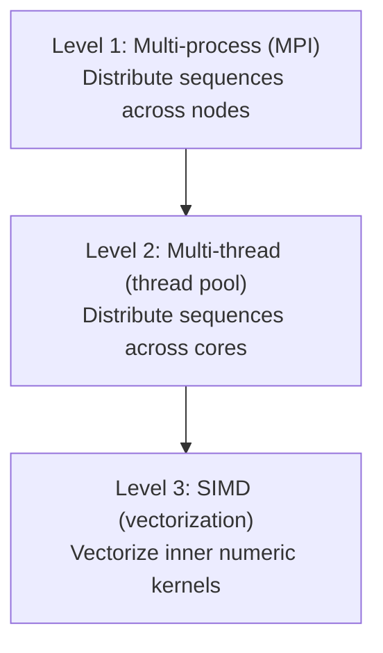
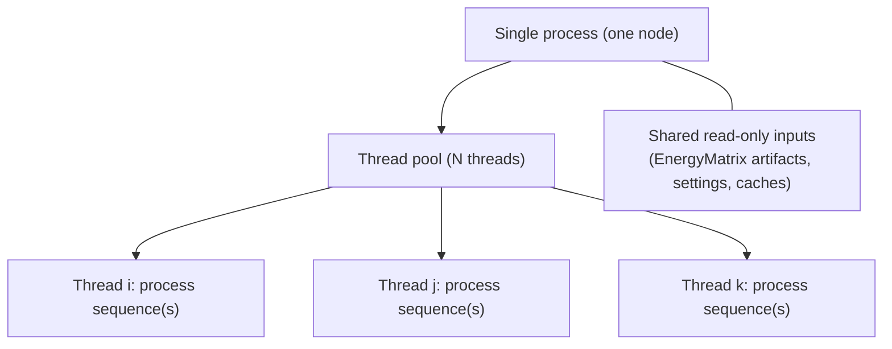
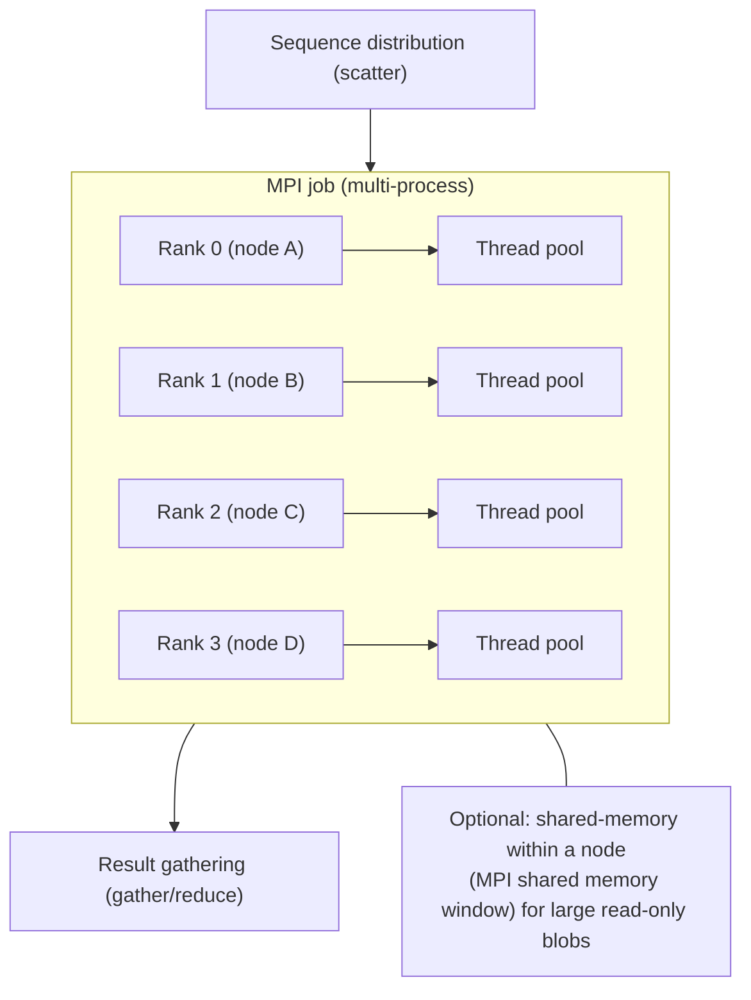

# Parallelism Hierarchy: Process → Thread → SIMD

## Overview

K* parallelization uses a 3-level hierarchy:



## Current Implementation: Phase 1 (Thread Pool Only)

**What we have now**:
- **Level 2**: Thread pool distributes sequences across CPU cores
- **Single process**: All threads share memory (zero-copy)
- **Single node**: Limited to cores on one machine

**Architecture**:


**Limitations**:
- Max parallelism = number of CPU cores (typically 4-32)
- Cannot scale beyond single node
- Memory limited to single node

## Phase 3: Adding MPI (Multi-Process)

**What MPI adds**:
- **Level 1**: Distribute sequences across multiple processes (nodes)
- **Shared memory**: MPI-3 shared memory for zero-copy data sharing
- **Multi-node**: Scale across cluster

**Architecture**:


**How it works**:
1. **Sequence distribution**: Rank 0 distributes sequences across ranks
2. **Shared ConfSpace**: Loaded once, shared via MPI-3 shared memory (zero-copy)
3. **Per-rank processing**: Each rank processes its sequences using thread pool
4. **Result gathering**: Rank 0 collects results from all ranks

**Benefits**:
- **Scale beyond single node**: 4 nodes × 16 cores = 64-way parallelism
- **Fault isolation**: Process crash doesn't kill entire job
- **Memory scaling**: Each node has its own memory
- **Zero-copy**: Shared memory eliminates serialization

## Complete Hierarchy

### Level 1: MPI (Multi-Process)
**Purpose**: Distribute work across nodes/processes
**Granularity**: Sequences (coarse-grained)
**Communication**: MPI-3 shared memory (zero-copy)
**Scaling**: Linear with node count (up to network limits)

**Example**: 100 sequences, 4 nodes
- Rank 0: Sequences 0-24
- Rank 1: Sequences 25-49
- Rank 2: Sequences 50-74
- Rank 3: Sequences 75-99

### Level 2: Thread Pool (Multi-Thread)
**Purpose**: Distribute work across CPU cores
**Granularity**: Sequences (medium-grained)
**Communication**: Shared memory (zero-copy)
**Scaling**: Linear with core count (up to NUMA limits)

**Example**: 25 sequences on Rank 0, 16 cores
- Thread 1: Sequence 0
- Thread 2: Sequence 1
- ...
- Thread 16: Sequence 15
- (Sequences 16-24 wait for available thread)

### Level 3: SIMD (Vectorization)
**Purpose**: Vectorize energy calculations
**Granularity**: Energy calculations (fine-grained)
**Communication**: Register-level (no communication)
**Scaling**: 4-8x for vectorizable code

**Example**: Energy calculation for 8 atom pairs
- Scalar: 8 iterations
- SIMD (AVX-512): 1 iteration (8 pairs in parallel)

## Data Structure Implications

### ConfSpace (Read-Only, Shared)
- **MPI Level**: Shared via MPI-3 shared memory window
- **Thread Level**: All threads read from same memory (read-only)
- **SIMD Level**: Memory layout optimized for vectorization (aligned)

### Sequences (Independent)
- **MPI Level**: Distributed across ranks
- **Thread Level**: Distributed across threads
- **SIMD Level**: Not applicable (sequences are metadata)

### Partition Function Results (Independent)
- **MPI Level**: Gathered to rank 0
- **Thread Level**: Collected per thread, merged
- **SIMD Level**: Not applicable (results are aggregates)

## Algorithm Implications

### K* Algorithm Structure
```
For each sequence:
  1. Compute partition function (protein)
  2. Compute partition function (ligand)
  3. Compute partition function (complex)
  4. Calculate K* score
```

**Parallelism opportunities**:
- **Between sequences**: Independent → perfect for MPI/threads
- **Within partition function**: A* search → can use SIMD for energy calculations
- **Energy calculations**: Many independent pairs → perfect for SIMD

### Profiling Results Connection

**From workload profiling**:
- **Energy matrix**: 4.3x super-linear scaling → SIMD opportunity
- **K* sequences**: Independent → MPI/thread opportunity
- **Memory**: Large ConfSpace → Shared memory benefit

**Parallelism matches workload**:
- **Coarse-grained** (sequences) → MPI/threads
- **Fine-grained** (energy) → SIMD

## Implementation Phases

### Phase 1: Thread Pool (Current)
- **What**: Multi-threading on single node
- **Speedup**: 4-32x (depending on cores)
- **Complexity**: Low (C++20 standard library)

### Phase 2: SIMD
- **What**: Vectorize energy calculations
- **Speedup**: 4-8x for energy calculations
- **Complexity**: Medium (intrinsics, alignment)

### Phase 3: MPI
- **What**: Multi-process across nodes
- **Speedup**: 2-4x per additional node
- **Complexity**: High (MPI programming, shared memory)

## Why Start with Thread Pool?

1. **Biggest win first**: 10-100x speedup vs. 2-5x for allocation-churn reduction
2. **Lower complexity**: Standard C++20, no MPI required
3. **Validate approach**: Test correctness before adding MPI
4. **Incremental**: Can add MPI later without changing thread pool code

## MPI Integration Design (Phase 3)

**Key insight**: Thread pool code doesn't change. MPI wraps it:

```cpp
// Phase 1 (current): Single process
KStarParallel<double> kstar;
auto results = kstar.compute(sequences, ...);

// Phase 3: MPI wrapper
if (mpi_rank == 0) {
    // Distribute sequences
    auto local_sequences = distribute(sequences, mpi_rank, mpi_size);
} else {
    auto local_sequences = receive_sequences();
}

// Each rank uses same thread pool code
KStarParallel<double> kstar;
auto local_results = kstar.compute(local_sequences, ...);

// Gather results
auto all_results = gather_results(local_results);
```

**Design principle**: Thread pool is independent. MPI orchestrates multiple instances.

