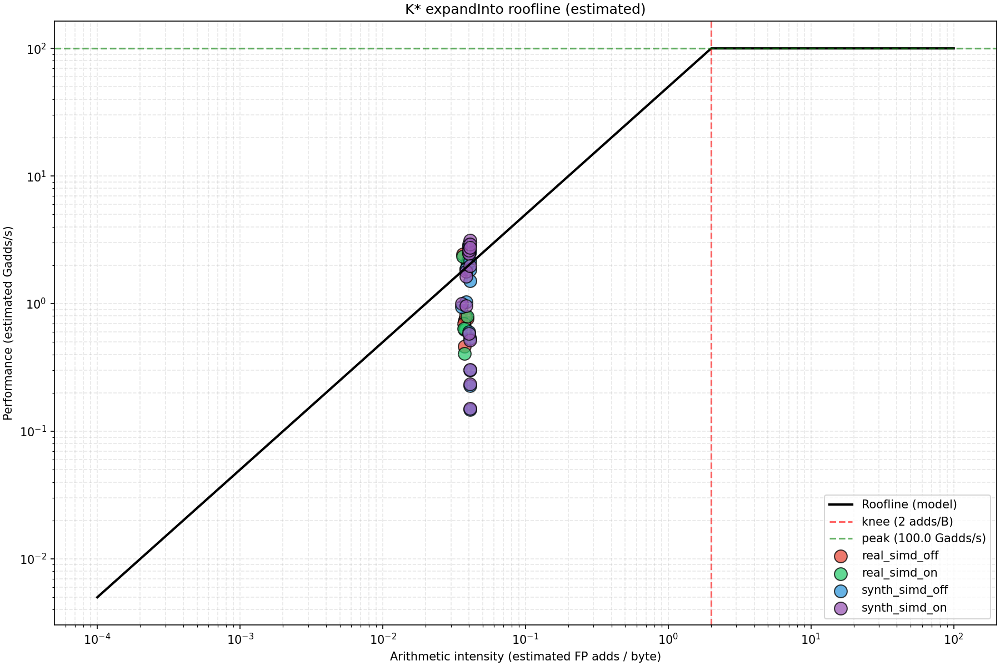
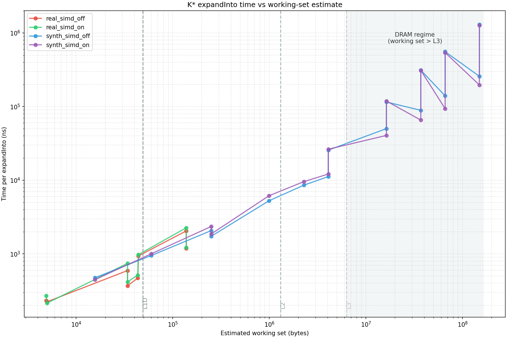

# Roofline notes: `expandInto` microbenchmark

This note documents how to run the `expandInto` roofline microbenchmark + plotting, and how to interpret results.

## Plots (repo-tracked)





## Data source: real molecules vs synthetic

There are two distinct benchmark families in this codebase:

- **A* search benchmark (`kstar_astar_search_bench`) uses molecule-derived `.emat.bin` inputs**
  - file: `src/test/cpp/kstar/bench_astar_search_google_benchmark.cpp`
  - cases `0..4` load from repo/build test data (protein/ligand/complex and larger matrices)
  - case `5` (“External”) loads a user-provided `.emat.bin` via `OSPREY_KSTAR_ASTAR_BENCH_EMAT`

- **Roofline benchmark (`kstar_expandinto_roofline_bench`) uses a synthetic generated `EnergyMatrix`**
  - file: `src/test/cpp/kstar/bench_expandinto_roofline_google_benchmark.cpp`
  - energies are deterministically generated (PRNG-seeded) one-body and pairwise values
  - “large system sizes” in the roofline plots are synthetic by construction; the goal is to control working-set size and access patterns

- **Roofline benchmark also includes a real `.emat.bin` mode**
  - same binary, additional benchmark: `BM_AStarFast_ExpandInto_Roofline_RealEmat`
  - loads `.emat.bin` via `EnergyMatrixLoader` + `test_data_paths.hpp` resolution
  - intended for comparing synthetic scaling against a molecule-derived RC distribution and block shapes

## Why points can appear “above” the roofline

The plot produced by `scripts/tools/plot_kstar_expandinto_roofline.py` overlays measured points on a **simple** roofline model:

- $\text{gops} = \text{fp\_adds\_est} / \text{time}$ (derived from benchmark counters + wall time)
- $\text{ai} = \text{fp\_adds\_est} / \text{bytes\_est}$ (derived from *estimated* bytes)
- model ceilings:
  - compute ceiling: `--peak-gops` (default `100`)
  - bandwidth ceiling: `--bw-gbs` (default `50`)

If a point appears above the plotted “roofline”, it does **not** imply the machine exceeded physical limits. It implies the plotted line is **not the correct ceiling for the memory hierarchy path exercised by the benchmark**, or that the AI/bytes estimate is off.

Common causes:

- **DRAM bandwidth used as the ceiling while the benchmark is cache-resident**
  - `expandInto` often operates on working sets that fit in L1/L2/L3 (see the separate working-set plot and cache markers).
  - Cache bandwidth is far higher than DRAM. A DRAM-based roofline will be too low, so cache-resident points can sit “above” it.

- **`bytes_est` is an estimate, not measured traffic**
  - Even if the “logical bytes touched” is correct, “bytes transferred” depends on cache line fills, write-allocate, prefetch, and reuse.
  - If `bytes_est` is too small, AI shifts right and points move “up/right” relative to the model line.

- **Model knobs are user-chosen**
  - `--peak-gops` and `--bw-gbs` default values are placeholders. If they are below the real ceilings, points will exceed the line by construction.

## Getting more accurate `bytes_est` (measured instead of estimated)

### Option A: Use hardware performance counters (recommended on Linux bare-metal)

Goal: replace/augment `bytes_est` with counters that approximate **actual data movement** at some level of the hierarchy.

Practical approaches:

- **LLC misses → DRAM bytes** (rough DRAM traffic proxy):
  - $\text{bytes} \approx 64 \times \text{LLC\_misses}$ on x86 (64-byte cache lines)
  - Example tooling: `perf stat` with `LLC-load-misses`, `LLC-store-misses` (event names vary by CPU).

- **L2 or L3 fill counters → bytes at that level**
  - Often better for cache-resident kernels where DRAM misses are near zero.
  - Events vary by Intel vs AMD (and even by generation).

How to plumb this into the pipeline:

1. Run the benchmark under `perf stat` and capture counters per benchmark case (harder), or run a single-case filter and capture counters for that case (easier).
2. Convert chosen counters into bytes moved using cache-line size assumptions.
3. Add those bytes as additional benchmark counters (e.g. `bytes_measured_l3`) or postprocess the JSON and override `bytes_est`.

Limitations:
- WSL often has limited PMU support for cache/uncore events; on bare-metal Linux this is straightforward.

### WSL note: what is realistically available

In WSL, `perf record` / `perf report` on `cycles:u` can work, but detailed cache/memory-traffic counters are often unavailable or unreliable (CPU generation + WSL host dependent).

Quick capability check:

```bash
perf list | egrep -i 'llc|l2|l3|mem_load|offcore|uncore|imc' | head
perf stat -e cycles,instructions,LLC-load-misses,LLC-store-misses -- true
```

Interpretation:
- If `perf stat` prints `<not supported>` / `<not counted>` for LLC events, WSL cannot provide a DRAM-bytes proxy on this machine.
- If only `cycles` / `instructions` work, the pipeline can still produce IPC and time-based plots, but not measured bytes moved.

### Option B: LIKWID / Intel PCM / VTune

If you want consistent bandwidth numbers without hand-selecting perf events:

- **LIKWID** (`likwid-perfctr`) can report bandwidth and cache traffic with preset groups (Linux).
- **Intel PCM** can report memory/channel bandwidth and some cache metrics (Intel).
- **VTune** can generate roofline + memory traffic breakdowns (Intel).

These tools can produce “measured bytes” and bandwidth ceilings to feed back into the plot model.

### Option C: Instrumentation in code (portable but intrusive)

If PMU tooling is unavailable:

- Add counters for “logical bytes touched” by design:
  - number of one-body loads, pairwise loads, stores
  - multiply by element size
- This still does not equal “bytes transferred”, but it makes `bytes_est` internally consistent and auditable.

## Commands: generate JSON + plots (SIMD on/off comparison)

Run the benchmark and save JSON (SIMD on):

```bash
cd /mnt/c/Users/denis/Documents/jobs_october_2025/ten63/osprey-fork_modern/build/cpp/kstar-perf
./kstar_expandinto_roofline_bench --benchmark_format=json --benchmark_out=expandinto_roofline_simd_on.json
```

Run only the real-`.emat.bin` mode (requires test_data to be discoverable; see `test_data_paths.hpp`):

```bash
cd /mnt/c/Users/denis/Documents/jobs_october_2025/ten63/osprey-fork_modern/build/cpp/kstar-perf
./kstar_expandinto_roofline_bench \
  --benchmark_filter='^BM_AStarFast_ExpandInto_Roofline_RealEmat/.*' \
  --benchmark_min_time=200ms \
  --benchmark_repetitions=3 \
  --benchmark_report_aggregates_only=true \
  --benchmark_format=json \
  --benchmark_out=expandinto_roofline_real_emat.json
```

Observed example output (WSL perf build, `--benchmark_report_aggregates_only=true`):

- The shipped test-data `.emat.bin` inputs are **small** in absolute size (e.g. `num_pos` in {4,7,8,10} for the current cases).
- This mode is therefore primarily useful to demonstrate **real RC-count distributions** and block shapes, not DRAM pressure.
- `k_mode` changes the amount of remaining work at constant `EnergyMatrix` size; mid-level points can be faster than root because
  `(num_pos - k_level - 1)` is smaller.

Optional scalar build (SIMD intrinsics off) for comparison:

```bash
cd /mnt/c/Users/denis/Documents/jobs_october_2025/ten63/osprey-fork_modern
cmake -S src/main/cpp/kstar -B build/cpp/kstar-perf-scalar \
  -DKSTAR_ENABLE_BENCHMARKS=ON \
  -DKSTAR_ENABLE_SIMD_INTRINSICS=OFF \
  -DCMAKE_BUILD_TYPE=RelWithDebInfo
cmake --build build/cpp/kstar-perf-scalar -j --target kstar_expandinto_roofline_bench

cd /mnt/c/Users/denis/Documents/jobs_october_2025/ten63/osprey-fork_modern/build/cpp/kstar-perf-scalar
./kstar_expandinto_roofline_bench --benchmark_format=json --benchmark_out=expandinto_roofline_simd_off.json
```

Plot both (note: `--input` expects `label=path.json`):

```bash
cd /mnt/c/Users/denis/Documents/jobs_october_2025/ten63/osprey-fork_modern
python3 scripts/tools/plot_kstar_expandinto_roofline.py \
  --input simd_on=build/cpp/kstar-perf/expandinto_roofline_simd_on.json \
  --input simd_off=build/cpp/kstar-perf-scalar/expandinto_roofline_simd_off.json \
  --out-dir build/cpp/kstar-perf/plots_expandinto_roofline
```

## Comparison plot: synthetic vs real `.emat.bin`

To generate a single plot that contains both the synthetic sweep and the real-`.emat.bin` points (with SIMD on/off), run:

```bash
cd /mnt/c/Users/denis/Documents/jobs_october_2025/ten63/osprey-fork_modern
bash scripts/tools/run_kstar_expandinto_roofline_real_vs_synth.sh OUT_DIR=build/cpp/kstar/roofline_plots MIN_TIME=200ms REPS=3
```

## Making the model match the hierarchy you’re exercising

If your points are cache-resident, a DRAM bandwidth ceiling is the wrong line to compare against.

Two concrete ways to make the plot internally consistent:

- Set `--bw-gbs` to a cache-level bandwidth ceiling (L3 or L2), not DRAM.
- Set `--peak-gops` to the actual peak for the relevant instruction mix (scalar vs SIMD, adds vs FMAs, etc.).

This does not change the benchmark. It changes the ceiling line so it bounds the measured points for the hierarchy you are actually using.

## Interpreting the working-set plot: non-monotonic segments

The working-set plot uses `working_set_bytes_est`, which is dominated by `EnergyMatrix` storage and is largely a function of `(num_pos, rc)`.
It does **not** vary with `k_level`.

`expandInto` work does vary strongly with `k_level` because the dominant min-reduction loop scales with the number of remaining unassigned positions:

$
\text{work} \propto (\text{num\_pos} - k\_level - 1)\cdot \text{rc}^2
$

For the same `(num_pos, rc)` (same x-axis), multiple points exist (e.g. `k_level:0` vs `k_level:48`) with different work.
This appears as vertical “rise then drop” segments and should not be interpreted as a cache transition by itself.

## DRAM-scale synthetic point

The roofline benchmark includes a deliberately large case to push beyond LLC capacity:

- `(num_pos=96, rc=64)` has pairwise payload size:
- pairs $(= 96\cdot95/2 = 4560)$
  - per-pair block $(= 64^2 = 4096)$ doubles
  - bytes $(= 4560\cdot4096\cdot8 \approx 149\text{MB})$ of pairwise storage alone
